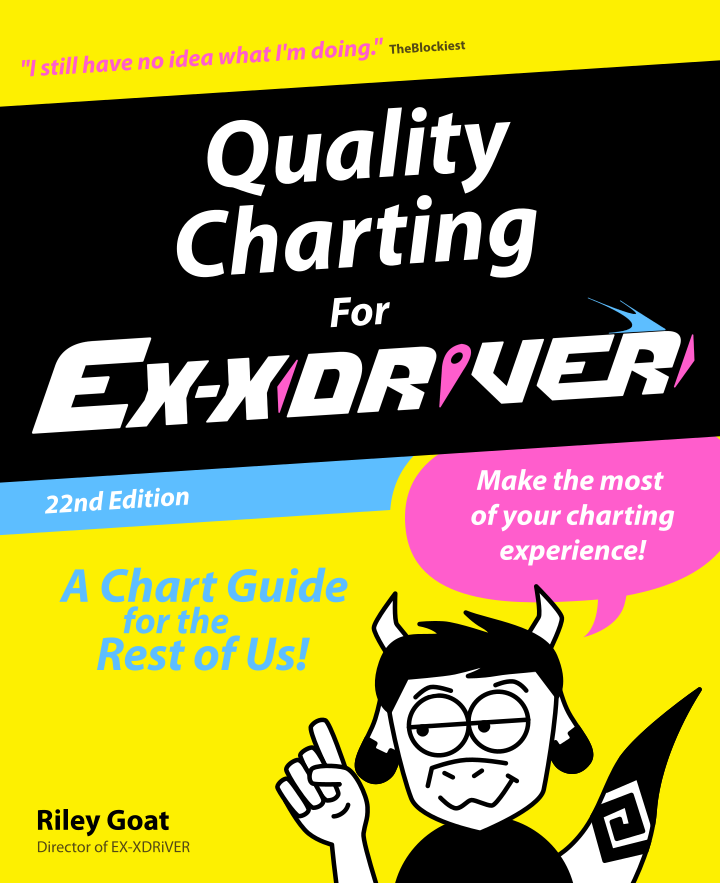

import { Badge } from '@astrojs/starlight/components';

<Badge text="v1.1" variant="note" /><Badge text="LATEST" variant="tip" />

---

- Added [Using Hold Notes](/xdrv-charting-guide/patterns/hold-notes) to Patterns.
- Added version number and latest changes to splash page.
- Added changelog page.
- Replaced page index references with hyperlinks.
 

<Badge text="v1.0" variant="note" />

---

- Documentation ported to website.
- Proofread and edited all documents except [Lowdiff Charting](/xdrv-charting-guide/patterns/lowdiff-charting)
 

*Where it all began...*

  
 