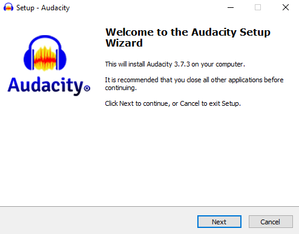
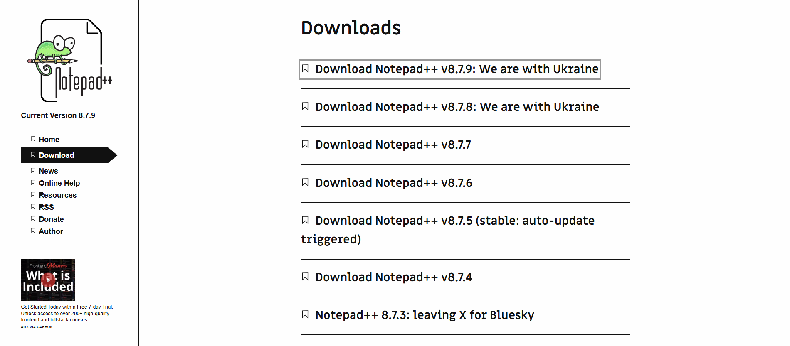
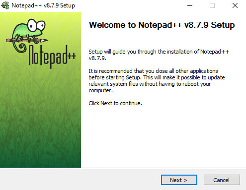
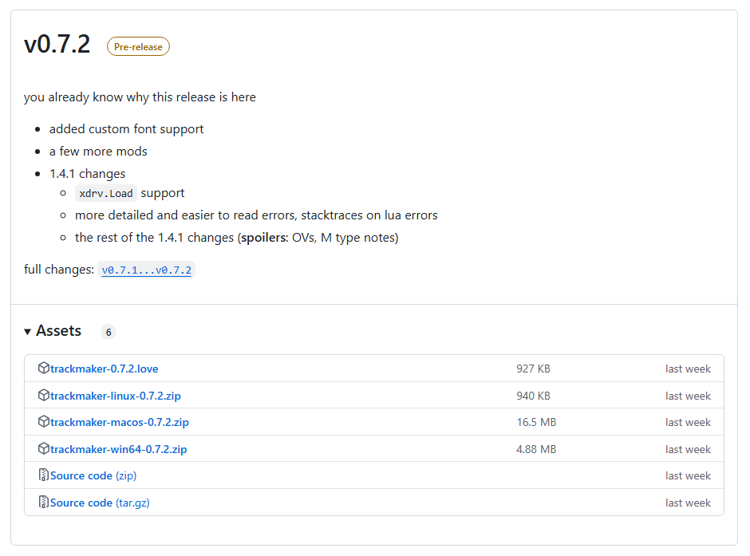
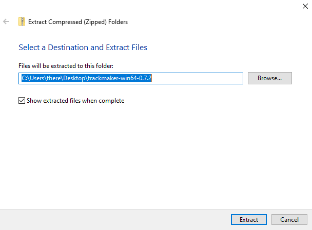
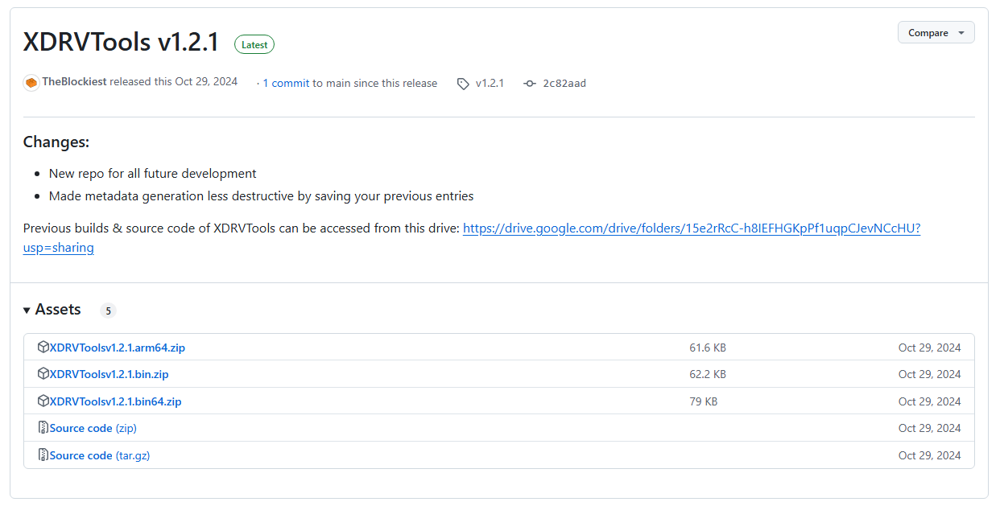
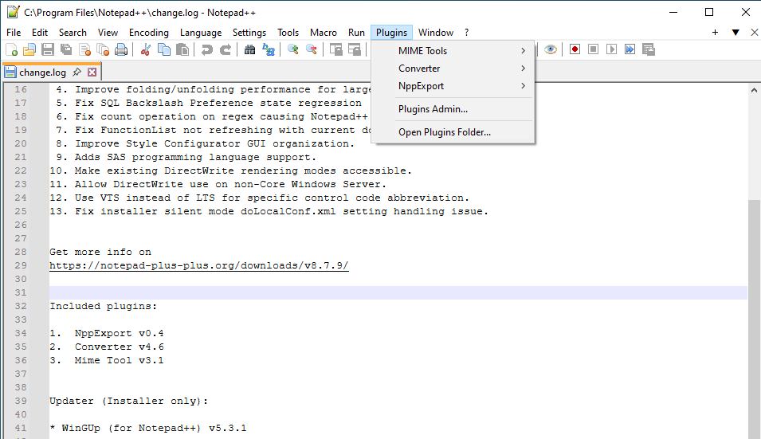
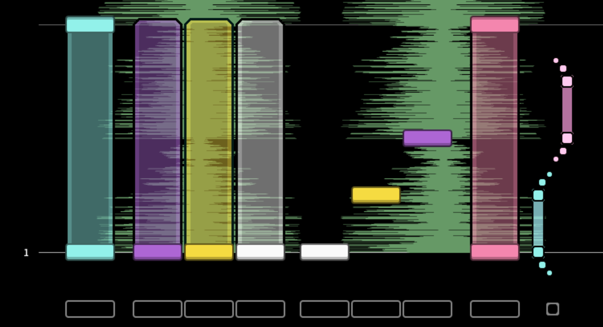

import { Steps } from '@astrojs/starlight/components';
import { Aside } from '@astrojs/starlight/components';
import { FileTree } from '@astrojs/starlight/components';
import { LinkCard } from '@astrojs/starlight/components';

<Aside type="note" title="Recommended Precursors">

- None!

</Aside>

---

Welcome! As you might know, the non-commercial rhythm game EX-XDRiVER (XDRV) supports custom chart. The process of creating a chart is called “charting.” Through charting, charters are able to show appreciation for their favorite songs, create memorable experiences for players, and contribute to the legacy of their favorite rhythm games. However, the process of charting for XDRV can be technical and daunting. Therefore, the EX-XDRiVER Charting Guide aims to help those who want to create XDRV charts by providing step-by-step instructions and explaining tricky concepts.

This article will explain how to obtain all of the charting tools useful in custom chart creation. Though various tools can be used interchangeably to make charts for XDRV, this tutorial will have you download the following:

<LinkCard
  title="Audacity"
  href="https://www.audacityteam.org/"
/>
<LinkCard
  title="Notepad++"
  href="https://notepad-plus-plus.org/"
/>
<LinkCard
  title="Trackmaker"
  href="https://github.com/oatmealine/trackmaker"
  description="Made by Oatmealine."
/>
<LinkCard
  title="XDRVTools"
  href="https://github.com/theblockiest/XDRVTools"
  description="Made by TheBlockiest. (aka me!)"
/>

## Installing Audacity

Audacity is a free audio editing software. Audacity will be used to export audio to the best format and time charts to the waveform. If you have an alternative software that contains audio exporting and a referenceable waveform, feel free to use that instead. Here are the steps for installing Audacity:

<Steps>

1. Go to the [Audacity](https://www.audacityteam.org/) website and download its most recent release, preferably without Muse Hub.

    

2. Run and progress through the Audacity Wizard.

    <div style="width:65%">
    
    </div>
</Steps>

## Installing Notepad++

Notepad++ is a free text and source code editor. Notepad++ will be used to edit chart metadata and potentially edit the raw note data of your chart. If you have another generic text editor that you would prefer to use, you can use that instead. However, you will not be able to use XDRVTools later, as it is a plugin that exclusively works on Notepad++.

<Steps>
1. Go to the [Notepad++](https://notepad-plus-plus.org/) website and navigate to the “Download” tab.

    

2. Select the most recent release of Notepad++ and select the big “Download” button.<br/>
(If you do not have a 64-bit system, you may need to select one of the 32-bit or ARM64 downloads below.)

3. Run and progress through the Notepad++ Setup.

    <div style="width:65%">
    
    </div>

</Steps>

## Installing Trackmaker

Trackmaker is an open-source XDRV chart editor developed by Jade. Trackmaker is the most streamlined tool for XDRV chart creation, so it is highly recommended. However, if you have former experience with ArrowVortex, a stepfile editor, it can be used to create XDRV charts instead.<sup>1</sup>

<Steps>

1. Go to the [Trackmaker](https://github.com/oatmealine/trackmaker) Github page and select the text that says “Releases.”

2. Find the most recent release of Trackmaker and open the “Assets” dropdown. You should now see a list of files.

    <div style="width:90%">
    
    </div>

3. Download the listed zip file that corresponds to your operating system by selecting it (not the source code).

4. Extract the downloaded zip to somewhere you can easily access it (I recommend your Desktop).<br/>
On Windows, you can extract a .zip file by right-clicking it and selecting “Extract all…”

    <div style="width:65%">
    
    </div>

5. Open the unzipped folder and run the Trackmaker application (trackmaker.exe).

</Steps>

## Installing XDRVTools

XDRVTools is an open-source extension for Notepad++ that provides functionality useful for editing XDRV chart files. If you do not have Notepad++ installed, XDRVTools cannot be used.

<Steps>

1. Go to the [XDRVTools](https://github.com/theblockiest/XDRVTools) Github page and select the text that says “Releases.”

    

2. Find the most recent release of XDRVTools and open the “Assets” dropdown. You should now see a list of files.

3. Download the listed zip that corresponds to your OS by selecting it. <br/>
(bin = 32 bit, bin_64 = 64 bit, and arm64 = arm64)

4. Extract the downloaded zip to your computer, and open the resulting folder.<br/>
Now that the plugin is on your computer, it needs to be manually brought into Notepad++ in order to work.

5. Open up Notepad++. Under “Plugins,” select “Open Plugins Folder…”

    

6. Within the opened plugins folder, create a new folder named `XDRVTools`. From the contents of the unzipped download, drag `XDRVTools.dll` into the `XDRVTools` folder.<br/>
Depending on your computer, this step may require administrator permissions.

    <FileTree>

    - Notepad++
        - plugins
            - XDRVTools
                - XDRVTools.dll

    </FileTree>

7. Relaunch XDRVTools, and check under “Plugins.” There should now be a listing for “XDRV Tools” with many different commands.
  
    <div style="width:65%">
    
    </div>

</Steps>

---

If you have installed all of the previous applications correctly, you now have the tools necessary to start charting! Of course, knowing how to use those tools to create XDRV charts requires more information.

Nonetheless, congrats on completing this first article! Organizing your toolkit is an important step in making your first XDRV chart.

---

### <sup>1</sup>Using ArrowVortex for XDRV Charting

If you have experience with [ArrowVortex](https://arrowvortex.ddrnl.com/), a stepfile editor, or if Trackmaker does not work on your computer, you can actually use ArrowVortex to create XDRV charts. This is because .sm files can be converted to XDRV charts within Trackmaker. In fact, this is how all XDRV charts used to be made! Here is how to set up ArrowVortex for XDRV charting:

<Steps>

1. Go to the [ArrowVortex](https://arrowvortex.ddrnl.com/) website and download your preferred version (both the most recent GitHub release and the 2017 legacy version work!)

2. Unzip ArrowVortex to somewhere you can easily access it.

3. In the directory where ArrowVortex is located, navigate to `settings` and open `styles.txt`.

    <FileTree>

    - ArrowVortex
        - settings
            - recent files.txt
            - settings.txt
            - shortcuts.txt
            - **styles.txt**

    </FileTree>

4. Add the following code to `styles.txt`:
    
    ```
    style {
    id = xdrv
    name = XDRiVER
    numCols = 10
    pad {
        row = CDEFGH
        row = A-BI-J
    }
    feetPos = BI
    mirrorH = AJ, BI, CH, DG, EF
    mirrorV = AJ
    }
    ```

5. Go the [ArrowVortex noteskin](https://discord.com/channels/1063248453737648199/1260646793247719477) Discord thread and download the most recent skin zip file.

6. Unzip the zip file to the `noteskins` folder in the ArrowVortex directory.

    <FileTree>

    - ArrowVortex
        - noteskins
            - xdrv
                - tex glow xdrv.png
                - tex glow.png
                - tex notes xdrv.png
                - tex receptors xdrv.png
                - xdrv.txt
            - ...

    </FileTree>

7. Open ArrowVortex, and create a new chart with the EX-XDRiVER (XDRiVER) style. The chart will automatically use the correct noteskin.

    <div style="width:80%">
        
    </div>

</Steps>

Charts made in Trackmaker do not save as `.xdrv` files, so they need to be converted in order to be played in-game. To convert the `.sm`/`.ssc` file generated by ArrowVortex to a `.xdrv` chart, open Trackmaker, select "Import..." under the "File" dropdown, then find your chart in the file explorer. Once the chart loads, it can be now saved as a playable `.xdrv` file!