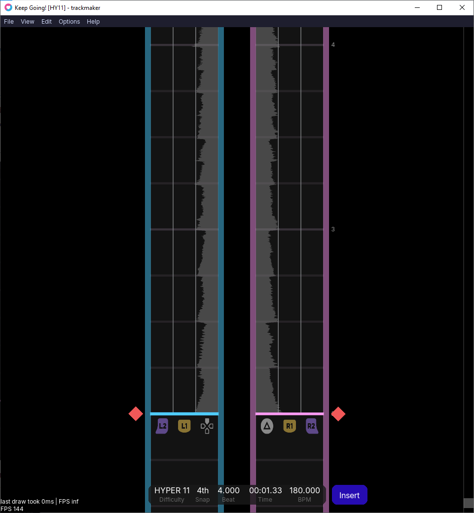
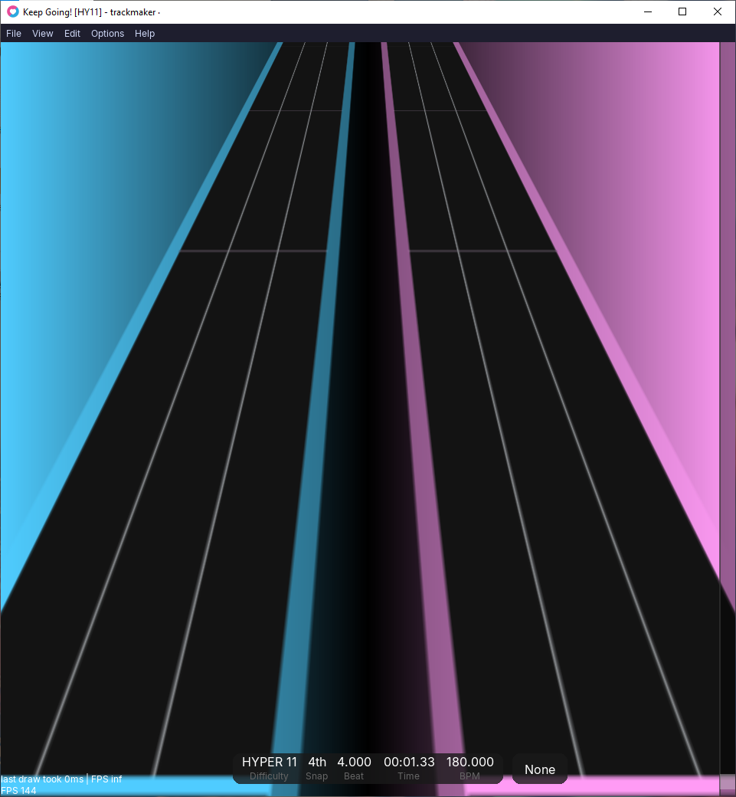
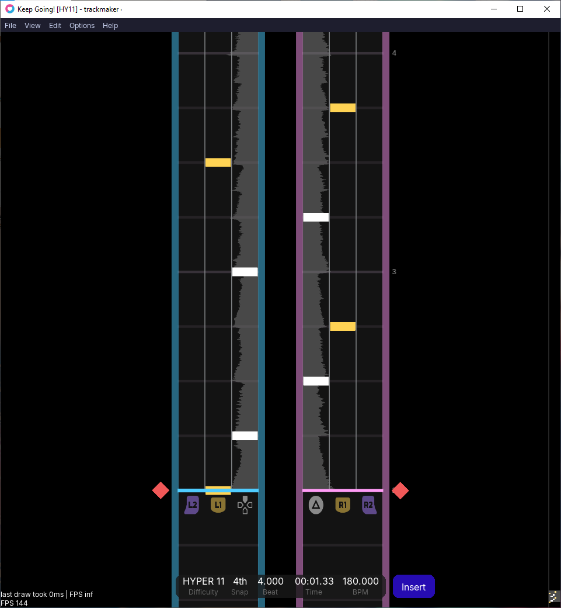
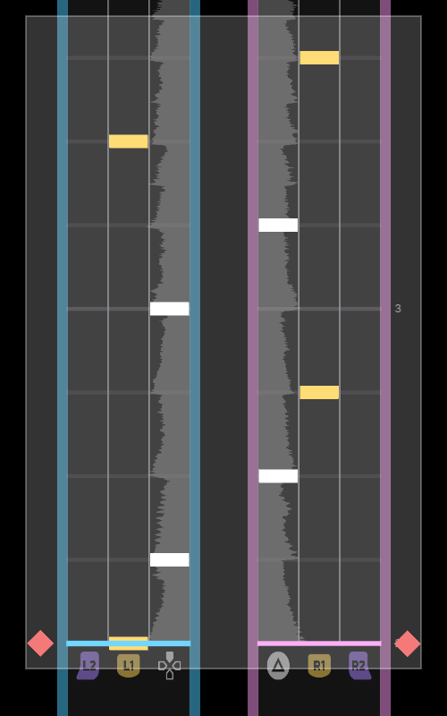
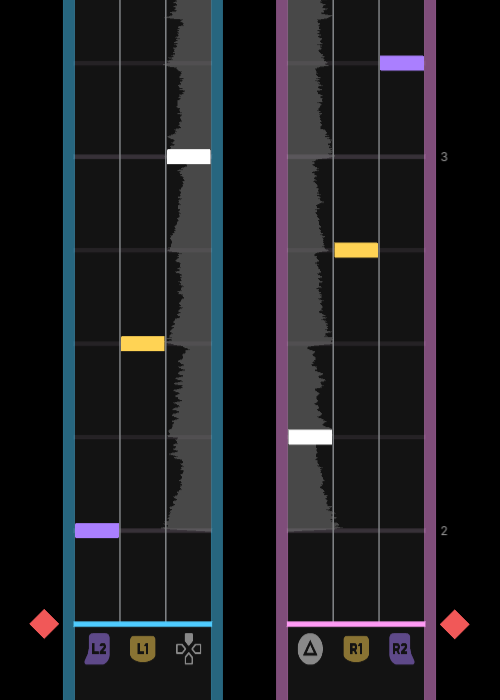
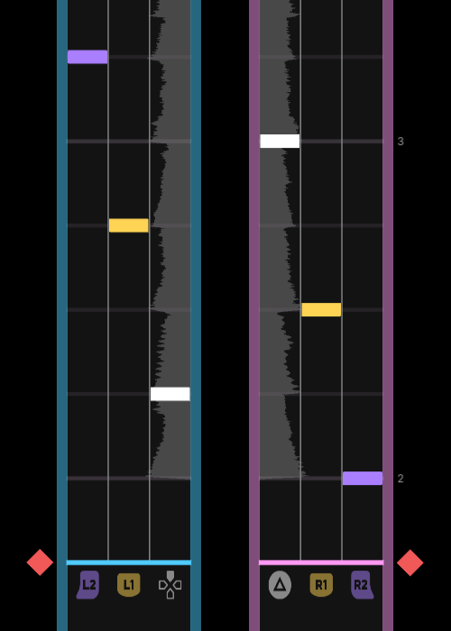
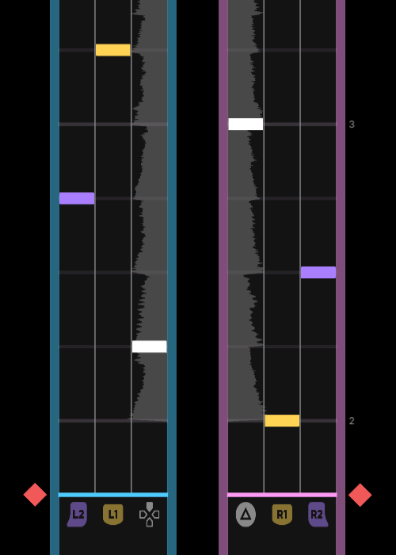

import { Aside } from '@astrojs/starlight/components';
import { Tabs, TabItem } from '@astrojs/starlight/components';
import { Card } from '@astrojs/starlight/components';
import { Icon } from '@astrojs/starlight/components';

<Aside type="note" title="Recommended Precursors:">

- Finished set up for a .xdrv chart (file organization, metadata, and timing)
- Downloaded Trackmaker

*This article exclusively discusses using Trackmaker to create a .xdrv chart. If you intend to use a different chart editor, this article does not apply.*

</Aside>

---

At this point, you should have a .xdrv file set up with the correct file organization and metadata. You should now be ready to start placing down notes, gears, and drifts in your chart. Trackmaker is a great tool for this process, as it is easy to pick up, has various QoL features, and is singularly tailored to XDRV. Taking advantage of Trackmaker's functionality can make charting both easier and faster.

Before you can edit any chart in Trackmaker, you need to specifically open it. To open the .xdrv file in Trackmaker, simply open Trackmaker, select “Open” under “File,” and select the .xdrv file you want to edit. If no errors appear in the top right corner and the chart's sync appears correct, you are ready to add patterns.

Trackmaker is best split into two modes of editing: “Write” and “Select” mode. Write mode has 3 additional sub-modes: “Insert,” “Append,” and “Rewrite.”

## Navigating Through The Chart

In both “Write” and “Select” mode, there are multiple ways to navigate through the chart's rows. Scrolling up or pressing the up arrow moves the chart forwards, while scrolling down or pressing the down arrow moves the chart backwards.

The “Snap” value determines the size of each step when moving. It also determines what subdivisions notes can be placed at. This value has a minimum of 4ths and a maximum of 192nds. To increase the subdivision of “Snap,” press the right arrow key. To decrease it, press the left arrow key.

If you want to quickly jump to a distant section of the chart, you can use the preview bar on the right side of the chart. Simply press what section of the chart you want to jump to, and the navigator will instantly go there.

If you want to see more or less of the duration of your chart, you can zoom in or out by holding `Ctrl` and scrolling.

### Adding Checkpoints

To add a checkpoint to a section, hover your mouse over the space to the left of your navigator or another subdivision. A small arrow icon will appear. Upon clicking, you will be prompted to place a checkpoint at a given beat and with a given name. The name of the checkpoint is not too important.

<Aside type="tip" title="Checkpoints">

Checkpoints are typically only a visual indicator for players, giving interesting names to sections with unique sounds. The names of these checkpoints are a good opportunity for narrative progression of clever wordplay.
Checkpoints have an additional use in Trackmaker. As checkpoints show on the preview scroll bar, you can use them to mark down important sections, making jumping around using the preview bar easier.

</Aside>

## Chart Playback

You can play a section of the chart that the navigator is currently at by pressing `Space`. This also plays the music at that section, allowing you to see the chart as players will. You can scroll while playback is happening without playback stopping. To stop playback, press the space button again.

### Music Playback Speed and Volume

In Trackmaker, playback volume can be increased by pressing `Shift+Up` and decreased by pressing `Shift+Down`. Meanwhile, playback speed can be increased by pressing `Shift+Right` and decreased by pressing `Shift+Left`. These changes are indicated in the top right corner.

<Aside type="caution" title="Decreasing Playback">

Decreasing the playback speed can be useful when charting dense or complicated rhythms. It is important to be careful, however, as some sounds that are barely present at normal speed can become more present at a lower speed, resulting in notes that feel out of place.

</Aside>

### Beat Tick and Note Tick

Beat tick, which plays a sound at the start of each beat during playback, can be toggled by pressing `F3`. Note tick, which plays a sound for every note during playback, can be toggled by pressing `F4`. These tools can help you check your chart’s sync.

### Preview Mode

If you want to look at your chart through a game-accurate, 3D lens, you can enable “Preview Mode” under “View.” Preview Mode also supports some mod playback.

## Undo/Redo, Save, and Reload

Trackmaker supports the behaviors of undoing/redoing, saving, and reloading your chart. The keybinds for Undo and Redo are `Ctrl+Z` and `Ctrl+Y` respectively. You can save your chart with `Ctrl+S` or reload your chart with `Ctrl+R`. These commands can also be accessed via dropdown.

<Aside type="caution" title="Saving and Reloading">

Although Trackmaker automatically creates one autosave and one previous version save, you must manually save the chart before closing it. Reloading is only necessary if you make changes outside of Trackmaker to a chart file.

</Aside>

## Write Mode

In Write mode, notes, gears, and drifts can be added to the chart. Throughout all 3 sub-modes, the keybinds for the note types stay the same. Write mode is indicated by the bottom right icon. If the bottom right icon says “None,” you are in Select mode. To enter Write mode from Select mode, press `Tab`. While in Write mode, press `Tab` to cycle through the sub-modes.

<Tabs>
  <TabItem label="Lane Notes">
| Note Type | Keys |
| :---: | :---: |
| 1   | `A`, `1` |
| 2   | `S`, `2` |
| 3   | `D`, `3` |
| 4   | `L`, `4` |
| 5   | `;`, `5` |
| 6   | `'`, `6` |
  </TabItem>
  <TabItem label="Gears">
| Gear Type | Key |
| :---: | :---: |
| Left | `Left Shift` |
| Right | `Right Shift` |
  </TabItem>
  <TabItem label="Drifts">
| Drift Type | Key |
| :---: | :---: |
| Left | `<` |
| Right | `>` |
| Tail/None | `/` |
  </TabItem>
</Tabs>

To place a tap note, press and release one of the lane keys on the same row. To place a hold note, press one of the lane keys, step the navigator forward until you reach the row you want the hold note to end, and then release. To place the head and tail of a gear, press one of the gear keys, step the navigator forward until you reach where you want the gear to end, and then release. For both hold notes and gears, you can also step backwards; in this case, the tail will be where you start and the head will be where you release. Lastly, to place a drift, simply press one of the drift keys.

To delete a specific note on the navigator's current row, simply press the key corresponding to that note.

### Write Sub-Modes

<Card title="Insert Mode" icon="pencil">

In Insert mode, the navigator does not automatically move forward when a note is placed. Insert Mode is optimal when placing patterns that are chord-heavy, have hold notes, or are complicated to pattern. Insert Mode is also all-around great for charting, and you will likely spend the majority of your time in this mode.

</Card>

<Card title="Append Mode" icon="pencil">

In Append mode, the navigator immediately moves forward one step when a note is placed. Append Mode is optimal for quickly creating long streams of notes. Append Mode is optimal for quickly creating long streams of notes. You can place hold notes while in Append mode, but you need to manually step the track forward / backward for the tail to appear. Gears and drifts to not cause the navigator to step forward while in Append Mode.

</Card>

<Card title="Rewrite Mode" icon="pencil">

When you place a lane note in Rewrite mode, the preexisting notes in the row are removed, and the navigator immediately moves forward to the next row containing notes. The “Snap” value also changes to the lowest subdivision possible. Rewrite Mode is limited in utility, with it only being useful for recharting stream or single-note patterns. Hold notes can only be placed if the navigator is manually stepped forward / backward. Gears and drifts do not remove notes or move the navigator **and** are not removed when a lane note is placed.

</Card>

## Select Mode

In Select mode, the charter can select notes that have already been placed and perform a number of commands on them. If you are in Write mode, you can get back to Select mode by pressing the `Esc` key.

To select a group of notes, click and drag across the chart to create a selection area. Upon making a new selection, your previous selection will be deselected unless you hold `Shift`. Pressing `Ctrl+A` selects all notes, while pressing `Esc` with an active selection deselects it. You can also delete the notes you have selected by pressing `Delete`.

| 
  
 | <Icon name="right-arrow" size="50px"/> | 
  
 |
| :---: | :---: | :---: |
| Selecting |  | Selected |

To select gears and hold notes, the selection region must contain both the head and the tail. Drifts can only be selected through selecting all notes with `Ctrl+A.`

### Mirror

You can mirror a selection of notes by selecting one of the “Mirror” options under “Edit.” The “Horizontally” option reflects all notes across the center of the track. The “Vertically” option swaps the middle and outer lanes of both tracks, swapping lane 1 and 2 **and** 4 and 5. “Both” performs both of these operations.

| 
  
 | 
  
 | 
  
 | 
  
 |
| :---: | :---: | :---: | :---: |
| None | Horizontal | Vertical | Both |

### Copy, Cut, and Paste

A selection of notes can be copied to the clipboard by pressing `Ctrl+C`. If you want to copy and delete this selection simultaneously, you can instead press `Ctrl+X` to cut the pattern. To paste the pattern at a different row, navigate to that row and press `Ctrl+V`. The first row of copied notes will be placed at the current row of the navigator, and all other copied rows will be placed relative to the first row.

<Aside type="caution" title="Note Conflicts">

Note conflicts occur when a pattern saved by Trackmaker cannot be hit. A common note conflict is a tap note in the middle of a hold note in one lane.

Mirroring and pasting can create note conflicts if you are not careful. Exercise caution when pasting or mirroring notes into a section where notes already exist.

</Aside>

## Visual Settings

There are a number of different visual options that Trackmaker provides, allowing charters to fine-tune their experience. Some of these options are:

- **View → Controller glyphs:** Allows you to see what lanes correspond to what keys or buttons in-game. This can be especially useful if you are trying to comprehend hand motions for different playstyles.
- **Options → Theme:** Allows you to change the colors of the UI and track.
- **Options → Colors:** Allows you to change the colors of the notes. Has both built-in options and custom options, which supports the same file type as XDRV.
- **Options → Waveform:** Generates a waveform that you can use to visualize the music at each section of the chart. May help with sync. This waveform has additional options below that allow you to increase the waveform’s resolution or tweak the waveform’s opacity/brightness.
- **Options → Cat:** Spawns in a cat that dances to the BPM. It’s cute.

## Unsupported Features

Currently, Trackmaker lacks support for timing segment creation. Although Trackmaker does allow you to edit or delete pre-existing segments by right-clicking on the markers that appear to the right of the track, the only way to create a timing segment from scratch is to open up the .xdrv file in a text editor and add the tag yourself. When you make a change, make sure to save the chart in the text editor and then reload the chart in Trackmaker. You can find a list of all timing segment types on the [XDRV Chart Documentation](https://github.com/EX-XDRiVER/Chart-Documentation/blob/main/xdrv.md#chart-body-timing-segments).

---

At this point, all of the most important functionality of Trackmaker has been covered. With all of this information at your disposal, the best way to get used to Trackmaker is to use it plenty.