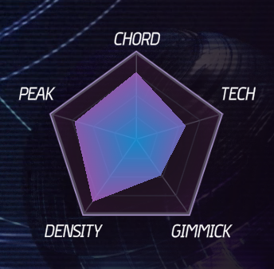

import { Aside } from '@astrojs/starlight/components';
import { Card } from '@astrojs/starlight/components';

<Aside type="note" title="Recommended Precursors">

- Knowledge of the process for making a standalone XDRV chart

</Aside>

---

Radar values are an important part of the presentation of XDRV charts. With a quick glance, a player can look at the radar value of a chart and immediately discern a few things about it: what the most prominent type of pattern is, whether or not a chart is mod-heavy, even roughly how difficult a chart will be. Because radar values are a useful tool for players, it is often valuable for charters to think about them and how players will perceive them.

Charters can use radars to determine if their chart is approximately accurate to the numeric difficulty they assigned. This can be done by comparing the radar values of official charts with your custom. For instance, if you assign a chart a difficulty of 12, but the chart’s radar looks more like a 14, you chart is probably misrated. 

<Aside type="caution" title="Chart Radars and Difficulty">

Note that chart radars do not directly correlate to the difficulties assigned. Although chart radars can be a solid indicator of difficulty, they may miss part of a chart’s difficulty that the charter can more easily identify.

</Aside>

## Radar Value Categories
 
Radar values, shaped like a pentagon, have 5 different categories: Density, Peak, Chord, Tech, and Gimmick. Each category is calculated by looking at specific factors of a chart. By changing specific factors of your chart, it is  possible to manipulate your chart’s radar values. Be careful, however, as **no change is worth worsening your chart’s quality.**

<Card title="Density" icon="star">

Density increases as the number of notes and gears in a chart increases. Density increases further for note and gear counts that do not consist of chords. One important factor that Density considers is the longest consecutive stream in a chart (the longer the stream, the greater the contribution to density). Density also considers song length.

If you want to increase Density, your best bet is to add more singular notes, potentially by making streams in your chart longer. If you want to decrease Density, you can typically accomplish this by breaking up continuous note streams at points of lessened emphasis.

</Card>

<Card title="Peak" icon="star">

The main factor that Peak considers is the maximum notes per second in the chart. Both maximum with and without chords is considered, though maximum notes per second without chords is weighted much higher. Peak also factors in the BPM of a song, capping at 300.

If you want to increase Peak, your best bet is to add more notes. If you want to decrease Peak, your best bet is to remove or simplify note patterns. This can be most effectively done by decreasing quantization. If you have 32nd bursts in your chart, replacing them with 16th holdstreams will drop the Peak value considerably.

</Card>

<Card title="Chord" icon="star">

The Chord value is related to the amount of chords in a chart, up to a certain threshold determined by the length of the chart. Of all categories, it is arguably the most simple.

Increasing Chord is as simple as adding more chords, while decreasing Chord is as simple as removing chords. Make sure that any chords you add or remove make sense in terms of emphasis.

</Card>

<Card title="Tech" icon="star">

The Tech value, in stark contrast to Chord, is the most complicated radar value of all five. The Tech value of a chart accounts for all of the following: total drift time, number of gears, number of crossgears, amount of one-handedness, number of note-gear chords, and even mines. The higher in volume that these elements are, the greater the chart’s tech value will be.

For the sake of brevity, Tech can be increased by adding more of these elements, while Tech can be decreased by removing some of these elements.

</Card>

<Card title="Gimmick" icon="star">

There are three separate categories of factors that impact the Gimmick value of a chart; timing segments, mines, and mods. Timing events are the various tags that go in the .xdrv file (#STOP, #WARP, #BPM, #TIME_SIGNATURE), while mods are the function calls made in the `.lua` file corresponding to your chart. Each timing event and mod contributes a different amount to the Gimmick value. Furthermore, mods scale off of their intensity.

To increase Gimmick, your best bet is to either add more mods or increase the intensity of preexisting mods. Typically, any sort of event you can call on a for loop (e.g. track bounces, note scale pulses) can contribute a lot to Gimmick rating with minimal effort. You can decrease Gimmick by removing or decreasing the intensity of mods. When changing intensity, bear in mind that mods can become too weak or too strong if you are not careful.

</Card>

---

Understanding how chart radars are calculated can be useful in many ways. Looking at the chart radar can help you gauge your chart’s own difficulty. It can also encourage you to focus on one category when designing a chart, which many base-game charts do. Above all else, the chart radar is an informational resource for players experiencing your chart for the first time.

| Radar&nbsp;Value | Contributing Factors |
| --- | --- |
| Density | Note count, single note count, longest consecutive stream, song length |
| Peak | Maximum notes per second (w & w/o chords), song BPM |
| Chord | Amount of chords in chart |
| Tech | Total drift time, gear count, crossgear count, one-handedness, note-gear chords, mines |
| Gimmick | Mines, mods |