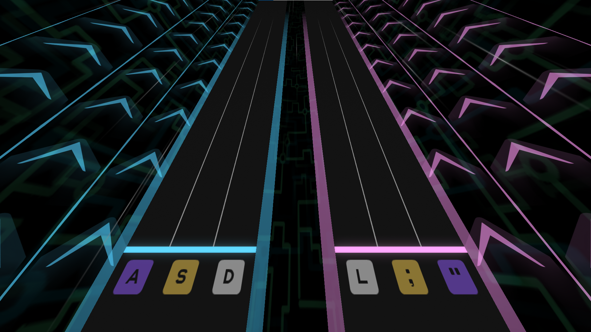
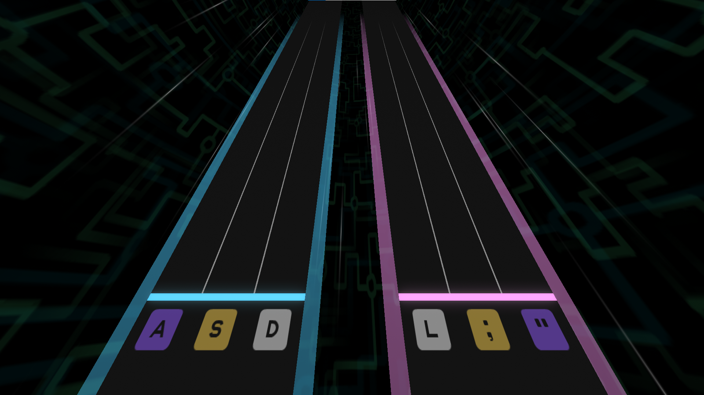
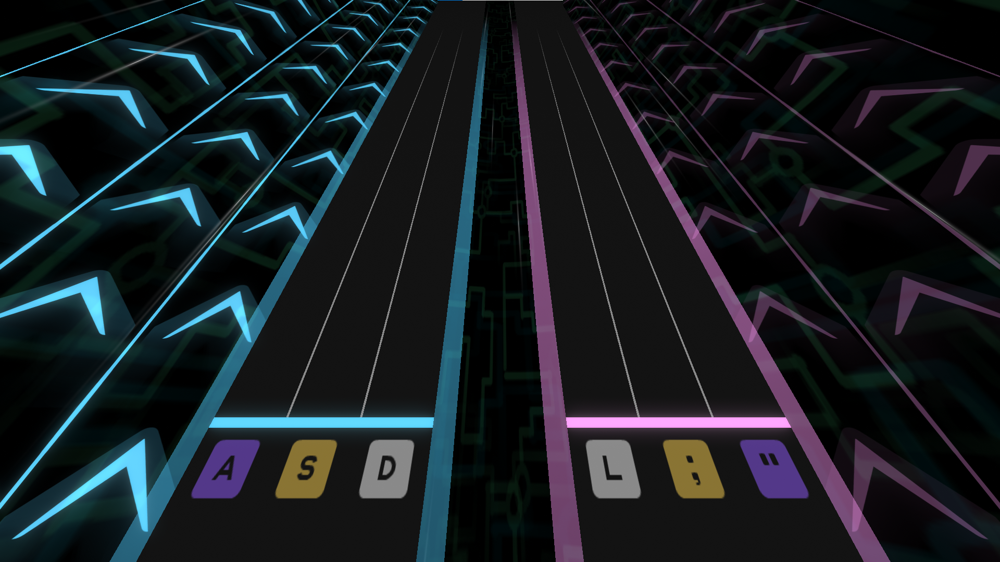
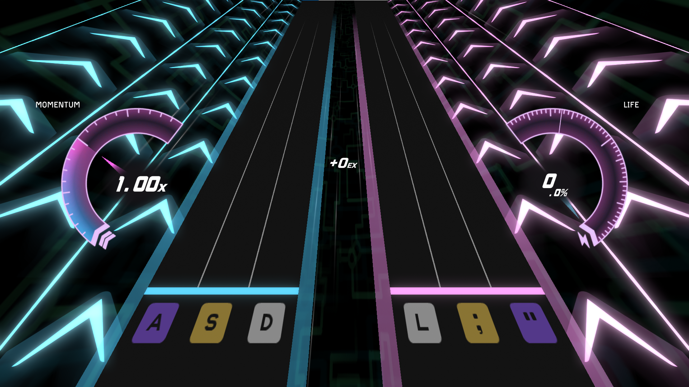
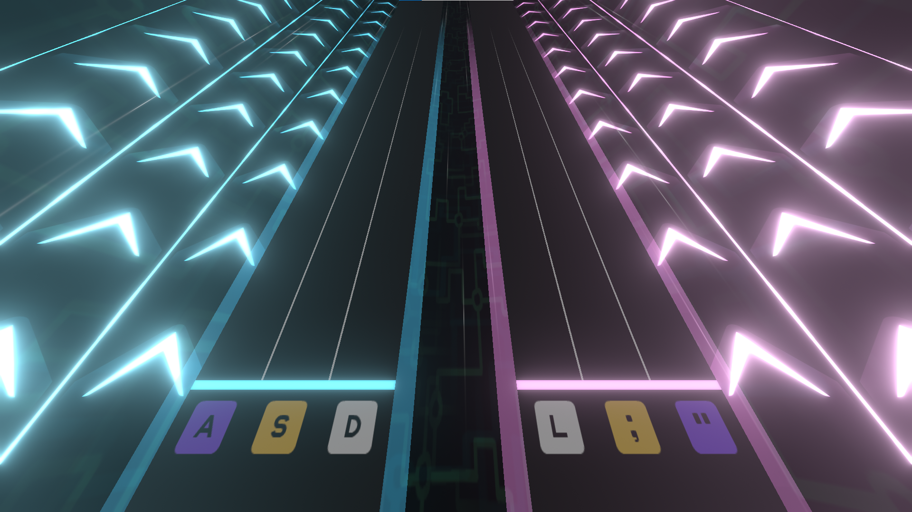
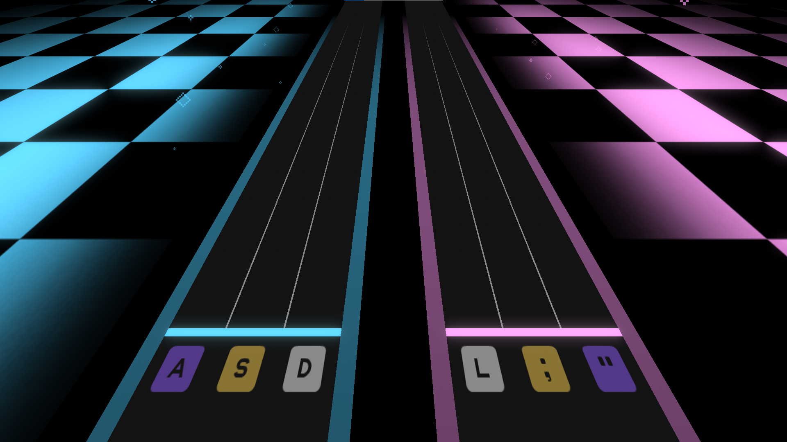
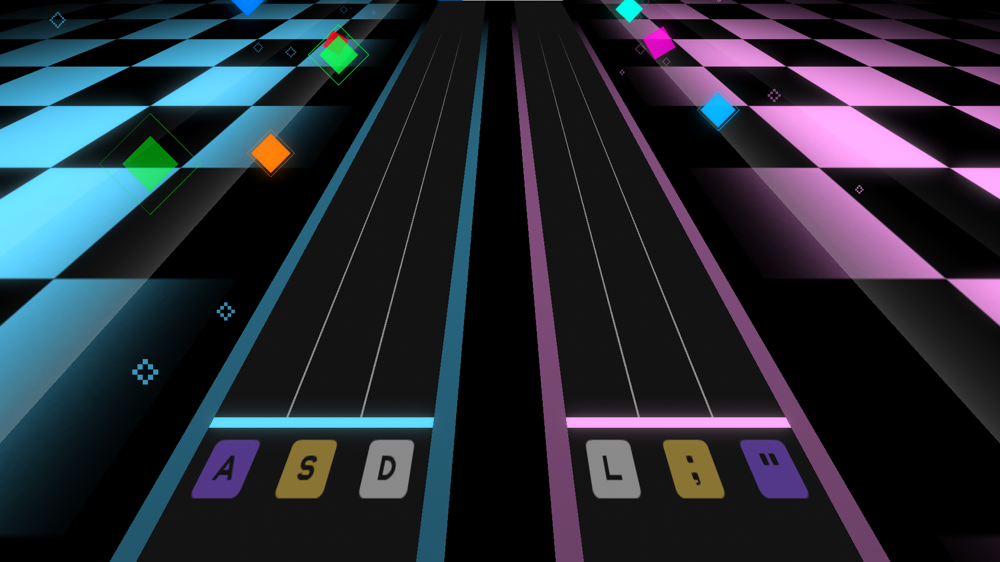

import { Aside } from '@astrojs/starlight/components';
import { Code } from '@astrojs/starlight/components';
import { Tabs, TabItem } from '@astrojs/starlight/components';

<Aside type="note" title="Recommended Precursors">

- Finished set up for a .xdrv chart (file organization, metadata, and timing)
- Finished set up for .xdrv modding (.lua file created and linked)
- Started/finished patterning for a .xdrv chart
- Familiar with the Lua language & background event creation

</Aside>

With each type of background event, there are different ways that charters can approach them and different rules to using them. Understanding each type of background event can help you use them more effectively.

Each background uses two collections of background events: a global set found across all backgrounds and a background exclusive-set.

## Background Alphas

In EX-XDRiVER, background alphas refer to values that control the opacity of sources of glow in the background. In `BackgroundTunnel`, background events can control the opacity of the left and right chevron paths. In `BackgroundCity`, background events can control the opacity of glow from the buildings, the floor, and the spotlights.

Background alpha values all default to 1 at the start of a chart, and supported values range from 0 to 1. When an alpha value decreases, the glow emitted from affected objects become weaker, with some objects becoming transparent. When an alpha value increases, the glow emitted from affected objects become stronger, with some objects becoming more opaque.

```lua
-- Events for any background
xdrv.RunEvent("SetPathAlpha","beat",4,0.5)
xdrv.RunEvent("EasePathAlpha","beat",8,0.9,4)
```

For each component that charters can change the alpha of, they have control of three values: a generic shared alpha value which affects both sides, a left alpha value, and a right alpha value. To determine the opacity of the left and right glow sources, the game multiplies the left / right side alpha value with the shared alpha value. Here are some examples of alpha value products on `BackgroundTunnel`.

<Tabs>
	<TabItem label="Example 1">
	

	PathAlpha = 0.5<br/>
	LeftPathAlpha = 1<br/>
	RightPathAlpha = 1

	Resulting Left Alpha: `0.5 * 1 = 0.5`<br/>
	Resulting Right Alpha: `0.5 * 1 = 0.5`

	</TabItem>
	<TabItem label="Example 2">
	

	PathAlpha = 0<br/>
	LeftPathAlpha = 1<br/>
	RightPathAlpha = 0.5

	Resulting Left Alpha: `0 * 1 = 0`<br/>
	Resulting Right Alpha: `0 * 0.5 = 0`

	</TabItem>
	<TabItem label="Example 3">
	

	PathAlpha = 1<br/>
	LeftPathAlpha = 0.75<br/>
	RightPathAlpha = 0.25

	Resulting Left Alpha: `1 * 0.75 = 0.75`<br/>
	Resulting Right Alpha: `1 * 0.25 = 0.25`

	</TabItem>
</Tabs>

---

This is very similar to how alphas across objects are controlled. Typically, each background has at least one alpha value that controls the glow of all objects on screen. Then, if the background has smaller objects that can be individually controlled, these objects have unique, controllable alpha values as well. These individual alpha values are still multiplied by the collective alpha. In `BackgroundDesert`, for instance, the player can control the alpha of the pyramids' glow using `StructureAlpha`, the torches' flames using `TorchAlpha`, or *both* using `DesertAlpha`.

<Aside type="tip" title="Switching Between Alphas">

You may want to control the shared alpha value in one section of a chart, but then control the left and right part individually in the next section, all without the alphas of each section interfering with each other. To accomplish this, you must set the alpha values to seamlessly switch between what values are controlled.

```lua
-- Make left and right alpha the ones we control
-- (Visually, both sides are set to 0.5)
xdrv.RunEvent("SetLeftPathAlpha","beat",4,0.5)
xdrv.RunEvent("SetRightPathAlpha","beat",4,0.5)
xdrv.RunEvent("SetPathAlpha","beat",4,1)

-- Make the shared alpha the one we control
xdrv.RunEvent("SetLeftPathAlpha","beat",8,1)
xdrv.RunEvent("SetRightPathAlpha","beat",8,1)
xdrv.RunEvent("SetPathAlpha","beat",8,0.5)
```

The same strategy can be used to control different objects in backgrounds with multiple alphas for each object.

</Aside>

### Fade-ins & Fadeouts

Fading alpha values in and out is a very common and simple technique that can be applied to easily represent the intensity of a song. Typically, louder or busier sections can be represented with higher alpha values, while quieter sections can be represented with lower alpha values. Fading an alpha value in or out over a longer period of time can represent risers/falls/sweeps.

<Aside type="tip" title="Matching Gears">

One thing that can be done with alpha values is to make the side alphas match the turning on and off of gears. When a gear starts on one side, you can bring that side's alpha quickly up. Then, when the gear ends, you can bring that side's alpha back down.

</Aside>

### Pulses

Pulses are a very common usage of alpha values that can be found across many charts. A pulse refers to a sequence of background events which quickly bring an alpha to an emphasized value and then slowly return the alpha to some value of rest. In turn, pulses are composed of three sequential segments: an in duration, hold duration, and out duration.

| Duration | Behavior |
| --- | --- |
| In | Over this duration, the alpha eases from an initial value to a peak value. Can be 0 (instant). |
| Hold | Over this duration, the alpha holds the peak value. Can be 0 (no hold). |
| Out | Over this duration, the alpha eases from the peak value back to the initial value. |

In other words, to create a pulse effect, simply **bring an alpha value up, hold it for any amount of time, and then fade the value back.**

Pulses are great for emphasizing nearly anything with impact, whether that be loud synths, kicks, snares, crashes, or even notes like gears. When using pulses, make sure that the change in alpha is enough to be visible to the player. Also make sure that your pulse does not (unintentionally) interfere with [bloom](#bloom) in the scene.

Since pulses follow a general structure, the best way to do them is with a helper function. An example of such a function can be found in [Helper Function Heap](/xdrv-charting-guide/modding/helper-functions/#pulse-functions).

<Aside type="caution" title="RunPulse vs Pulse">

Background events with the world "Pulse" like in `BackgroundVivid` and `BackgroundRush` are completely different from the pulses done with alpha values.

</Aside>

## UI Alphas

Very similar to background alphas, UI alphas refer to values that control the opacity of game UI. UI alphas are typically leveraged by charters to create moments of emphasis, reveal a song's name mid-chart, or lessen how much the UI obstructs gameplay. 



UI alpha values default to 1, and supported values range from 0 to 1, with 1 being fully visible and 0 being invisible.

```lua
-- Hype song reveal
xdrv.RunEvent("SetUIAlphaCurrentSongGroup","beat",-12,0)
xdrv.RunEvent("SetUIAlphaRadialGaugesGroup","beat",-12,0)
xdrv.RunEvent("SetUIAlphaProgressBar","beat",-12,0)

-- Note that setting and easing of all UI alphas
-- are controlled with just "Set" function
xdrv.RunEvent("SetUIAlphaCurrentSongGroup","beat",4,0,4)
xdrv.RunEvent("SetUIAlphaRadialGaugesGroup","beat",4,0,4)
xdrv.RunEvent("SetUIAlphaProgressBar","beat",4,0,4)
```

Also similar to background alphas, most alphas are grouped into collections, where the opacity of individual UI elements are determined by multiplying together all alpha values that control it. All UI are affected by the `UIAlpha` value. Then, each UI component is controlled by one of three groups: `CurrentSongGroup`, `PlayerResponseGroup`, or `RadialGaugesGroup`. Lastly, each UI element has an individual alpha value.

## Bloom

Bloom is another value that can be changed on all backgrounds, and its implementation across backgrounds is wholly consistent. Bloom is a post-processing effect which causes bright areas on the screen to appear brighter and more white.

`BloomIntensity` and `BloomDiffusion` both default to values of 1 at the start of a chart. When these values are increased, the effect of bloom on screen becomes more noticeable, and when decreased, the effect of bloom becomes less so. Generally, these values should be adjusted together as to produce a visually consistent effect.



```lua
xdrv.RunEvent("EaseBloomIntensity","beat",4,1.75,4)
xdrv.RunEvent("EaseBloomDiffusion","beat",4,1.75,4)
```

As with background alphas, bloom can be faded in and out or pulsed depending on the charter's needs. Charters should be careful, however, as the effect of bloom increases based on the value of background alphas in the scene. Higher background alphas result in stronger glow, which is amplified more by bloom. Charters should ensure that bloom does not become a visual nuisance when it is used. Generally, **1.5 is a good emphasis value for bloom; anything above that is extreme.**

### BloomBeat

BloomBeat is a special variety of bloom that can be used across all backgrounds. In short, when `EnableBloomBeat` is called at a certain beat, a bloom multiplier peaks up and then goes back down for that beat and each beat after. This effect continues until `DisableBloomBeat` is called.

```lua
xdrv.RunEvent("EnableBloomBeat","beat",12)
xdrv.RunEvent("DisableBloomBeat","beat",16)
```

BloomBeat is a really easy way to represent four-on-the-floor kicks or other per-beat impacts. For not-on-beat rhythms or musical sections that are very busy, BloomBeat can still be very fitting. Bear in mind that BloomBeat layers on top of your bloom intensity and diffusion values.

## Colorable Components

For backgrounds like `BackgroundRush`, the colors of components in the background can be adjusted to fit a variety of color schemes. Unlike alpha and bloom values, which use number values, colorable components can accept a color value, written in hex notation.


```lua
-- Events for BackgroundRush
xdrv.RunEvent("SetChevronColor","beat",-12,"#df3a40")
xdrv.RunEvent("SetBackgroundColor","beat",-12,"#203177")
xdrv.RunEvent("SetGridColor","beat",-12,"#f8e9e2")
```

<Aside type="caution" title="Color Defaults">

Each background with colorable components has different defaults. Furthermore, some backgrounds with colorable components blend color values using multiplication (multiplying the individual R, G, and B values), so you may need to set multiple colors to produce the intended effect.

```lua
-- Fix color blending
xdrv.RunEvent("SetLeftChevronColor","beat",-12,"#ffffff")
xdrv.RunEvent("SetRightChevronColor","beat",-12,"#ffffff")
```

</Aside>

## Background Actions

For backgrounds like `BackgroundVivid`, `BackgroundDesert`, and `BackgroundRush`, particular events can be invoked that cause special visual effects to fire off. These events all look different, so knowing how to optimally use each is a matter of experimenting with them and learning what works. Some of these events may even result in lingering changes to the background, making for environmental variety and sectioning of your chart. Additionally, some of these events work with just the minimum parameters, while other events require a few more values.

| <div style = "width:260px">  </div> | <div style = "width:260px">  </div> |
| --- | --- |
| Without Events | With Events |

```
-- Events for BackgroundVivid
xdrv.RunEvent("RunLeftPulse","beat",4)
xdrv.RunEvent("RunRightPulse","beat",6)
xdrv.RunEvent("RunSpawnColorSquares","beat",8)

-- Events for BackgroundDesert
xdrv.RunEvent("EnableTorches","beat",4,4)
xdrv.Runevent("DisableTorches","beat",20,4)

-- Events for BackgroundRush
xdrv.RunEvent("ShowCharacters","beat",12)
xdrv.RunEvent("FlipCharacters","beat",16)
xdrv.RunEvent("HideCharacters","beat",20)
```

<Aside type="tip" title="More Events!">

This was far from a comprehensive coverage of all background events in XDRV across all backgrounds in-game. To read up on all background events for EX-XDRiVER, refer to the official [XDRV chart documentation](https://github.com/EX-XDRiVER/Chart-Documentation/tree/main/backgrounds).

</Aside>

---

You might have a basic understanding of how you can use background events in your charts. From here, you might want to look at some base-game charts to see how they approach background events. Otherwise, the best way to get a handle on what background effects you should use per section is to start messing around with them. As you add background events to your charts, remember that, when joined with patterns and mods, simpler background events can sometimes be more impactful.