import { Aside } from '@astrojs/starlight/components';
import { Tabs, TabItem } from '@astrojs/starlight/components';
import { Badge } from '@astrojs/starlight/components';

import { YouTube } from 'astro-embed';

<Aside type="note" title="Recommended Precursors">

- Finished set up for a .xdrv chart (file organization, metadata, and timing)
- Finished set up for .xdrv modding (.lua file created and linked)
- Started/finished patterning for a .xdrv chart
- Familiar with the Lua language & mod creation

</Aside>

Mods are a particular special facet of EX-XDRiVER's charts: every chart has them. What might be a bit harder to parse is that there is a particular flavor and quality to most of the mods in XDRV. Most mods in XDRV are expressive and clean, interfering minimally with the playability of charts.

This is actually easier to achieve than you might expect! By generally following a few rules when it comes to the mods you create for EX-XDRiVER, you can create mods that align with the sentiments of EX-XDRiVER's modding. It also helps to know generally what each type of mod looks like in-game, including what values of emphasis and rest (typically the default position) look like for each.

<Aside type="tip" title="Mod Availability">

Unlike background events, which are different based on what background you use, mods are the same across all backgrounds (as in, the pool of mods is the same regardless of background choice).

</Aside>

## Modding Conventions

When creating mods for EX-XDRiVER, the basic goal of charters should be to represent the energy and motion of the song. There are a few rules that charters can follow to create mods that look great and add a controlled level of challenge to reading.

### Jumpcut vs Fluid Mods

In EX-XDRiVER, the types of mods you'll see in charts can be sorted into one of two categories: **jumpcut mods** and **fluid mods**. 

**Jumpcut mods** are mods which has starts value different from the values last set for their particular field. This can either result from an `xdrv.Ease` whose start value is different from the last value set *or* any `xdrv.Set`. While jumpcut mods are visually impactful, players are more likely to lose track of elements on screen, which can make a chart disorienting and patterns hard to read. This effect can be mitigated either by making the distance between the last value and the new value very small *or* by only using jumpcut mods when patterns are less dense or empty.

Opposite of jumpcut mods, **fluid mods** are mods (eases, typically) whose start value is the same as the value last set. In XDRV, the majority of mods used in charts are fluid mods, as players can follow and read them far easier. Despite how the category sounds, fluid mods can be smooth or snappy; it largely depends on what ease is used. `Out` eases tend to be snappier, while `InOut` or `In` eases tend to be smoother. Eases like `OutBack` or `OutElastic` are especially good for snappy impacts.

Notice how similar these two mods are, yet result in different effects:

<Tabs>
	<TabItem label="Jumpcut Example">
	```lua
	-- This mod brings the camera y position up
	xdrv.Ease("camera_move_y",0,1,"beat",4,"len",4,"InOutSine")

	-- This mod is jumpcut, returning the camera suddenly to rest
	xdrv.Set("camera_move_y",0,"beat",8)
	-- This will be a bit disorienting
	```
	<div style="width:80%">
	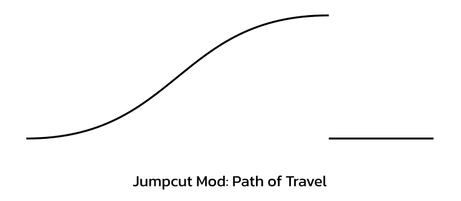
	</div>
	</TabItem>
	<TabItem label="Fluid Example">
	```lua
	-- This mod brings the camera y position up
	xdrv.Ease("camera_move_y",0,1,"beat",4,"len",4,"InOutSine")

	-- This mod is jumpcut, returning the camera to rest with an "OutElastic" motion
	xdrv.Set("camera_move_y",1,0,"beat",8,"len",1,"OutElastic")
	-- This mod will be fast and snappy, but not too disorienting
	```
	<div style="width:80%">
	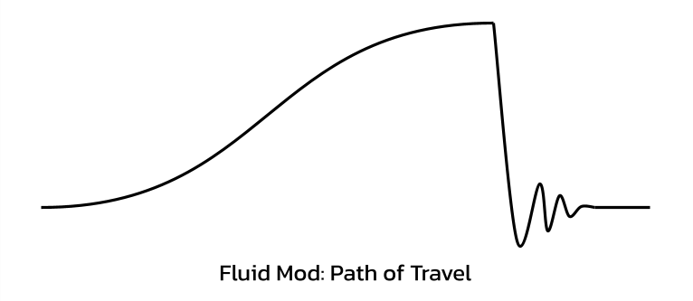
	</div>
	</TabItem>
</Tabs>

---

While fluid mods should be used considerably more in XDRV charts, jumpcut mods can be very effective when used properly. Consider referencing the following charts to see how both are used:

- And So You Felt EX
- jittter EX
- ENGINEDESTROYER EX

### Flowing Eases

Unlike background alphas, which tend to obscure eases and look seamless without much work, mods of different eases can have noticeable changes in velocity when back-to-back. This can result in mods that feel stilted and unnatural. To avoid this, consider the following principles when selecting eases:

- `InOut` mods, if fluidly following the last mod, will most always look smooth.
- `Out` mods end smoothly but start with an impulse. This impulse can usually be contextualized by a sound in your song.
- `In` mods end abruptly, which can feel weird and stilted, even if a sound in the song justifies it.
  - To mask this, you can place an `Out` mod at the end of the `In` mod, having the motion go either in the opposite direction or a bit in the same direction as the previous mod.
  - You can also lean into the change in velocity by doing a jumpcut mod to a totally different value.

### Matching Notes and Mods

In many charts, mods are written to match note types in the patterning. Sometimes, tracks move as gears are toggled on and off; other times, the camera leaps upwards when a hold chord occurs; even more, the camera moves further left or right when a drift occurs in that direction.

By making mods that reflect the patterning of your chart, you can improve the synergy between your modding and patterning, making the experience of playing your chart more fun and cohesive. Consider looking at the following chart to see how charts can synergize their mods and patterns:

- ETIQUETTE EX
- GUNK EX
- Fly Wit Me HY

<Aside type="tip" title="When Everything Matches">

If you match a note type to a certain sound, and *then* match a mod to that particular note type, you are (by proxy)  matching the mod to the sound as well! The resulting effect is that your patterns, charting, *and* mods are all unified, resulting in a very satisfying play experience.

</Aside>

### Per-Beat Mods

Per-beat mods refer to any mods that happen at a frequency of every beat. These mods are a common way of adding energy to sections that have no room for larger, one-shot mods. This can be something as small as having the camera pop up, having the speed scale down slightly, or briefly increasing the scale of notes. Per-beat mods are a perfect way of representing repeated percussion hits.

Per beat mods are typically implemented using for loops, like so:

```lua
-- Pop the camera up every beat
for i = 4, 24 do
	xdrv.Ease("camera_move_y",0.1,0,"beat",i,"len",0.75,"OutCubic")
end
```

For sounds that don't hit less than every beat, though their timing is inherently different, they can be approached similarly as per-beat. Furthermore, it can be interesting to layer different per beat mods. If you have a kick on every beat and snares on every other beat, for instance, you could represent each kick with a camera pop and each snare with a sideways track movement.

For good examples of per-beat mods, consider referring to the following charts:

- METASCHIMATIS EX
- ETIQUETTE EX
- valor/starcross EX

### Mirroring Motion

Similarly to patterning, if you feel that you have repeated a mod too many times, you can create some variety by having the mod operate in another direction. If in one mod, objects in the scene move right, you can repeat the mod later, but have objects move to the left instead. This can also prevent mods from skewing too hard on one direction, making mods feel unbalanced.

For per-beat mods, mirroring repeated motions can be very helpful, creating a small amount of variety. You can still use a for loop to accomplish that, but you'll want some variable to be flipped every so often.

```lua
-- Move the camera to the sides every beat
-- First occurence goes right, second goes left
local direction = 1 -- our variable to flip
for i = 4, 24 do
	xdrv.Ease("camera_move_x",0,0.5*direction,0,"beat",i,"len",0.25,"OutCubic")
	xdrv.Ease("camera_move_x",0.5*direction,0,"beat",i+0.25,"len",0.75,"InOutQuad")

	direction = -direction -- flips the variable
end
```

Unlike patterns, where the only feasible transformation is mirroring across the center of the playfield, mods can be transformed in more ways than one. Consider rotating a mod so that consecutive hits occur at angular increments (this might require some Lua trigonometry to accomplish).

### Less is More

It's easy to overdo the amount of mods you have in your chart by trying to represent every sound in the music with mods. Generally, however, by reserving your mods for the most impactful elements of each section, you can make a modfile that is cleaner, less cluttered, and better paced. Besides, if you have a sound you want to represent visually, but think mods would be too much, then a [background event](/xdrv-charting-guide/modding/bg-visuals/) might be the way to go.

## Mod Types and Frequencies

While XDRV supports a slew of different mods, you may notice that some mods appear more frequency in charts than others. This produces a positive effect on modfiles, as certain mods can be used more heavily, while rarer mods feel more special when used. In fact, the frequency of mods used is a large factor in the shared visual style of base-game mods in XDRV. As a charter, you can replicate these frequencies as well by implementing common mod types more heavily and using rarer mod types less.

For the sake of categorization, mod types in XDRV can be split into three categories: common mods that appear in nearly every modfile, uncommon mods that appear in only some modfiles, and rare mods only used for specific effects.

| Mod Frequency | Included Mods |
| --- | --- |
| <Badge variant="note" text="Common"/><br/>(Used in most modfiles) | Camera movement / rotation, track movement / rotation, speed |
| <Badge variant="tip" text="Uncommon"/><br/>(Used in some modfiles) | Note movement / scale, track scale, FOV, track color & opacity |
| <Badge variant="danger" text="Rare"/><br/>(Used only in special cases) | Render line movement, drift tilt multiplier, other opacity controls |

*For brevity, this article won't go into the rarer mods, but I recommend you explore them on your own!*

### Camera Movement & Rotation <Badge variant="note" text="Common"/>

In EX-XDRiVER, the camera can be moved to a variety of positions. In most charts, this manifests into one of four directions: bringing the camera up, bringing the camera down, bringing the camera left, or bringing the camera right.

Each of these motions can produce a different effect. Bringing the camera up is good for louder or atmospheric sections, while bringing the camera down can be good for quieter, more intimate sounds. Left and right camera motions are good for emphasising impacts.

See the following camera positions and accompanying code for reference:

<Tabs>
	<TabItem label="Default">
	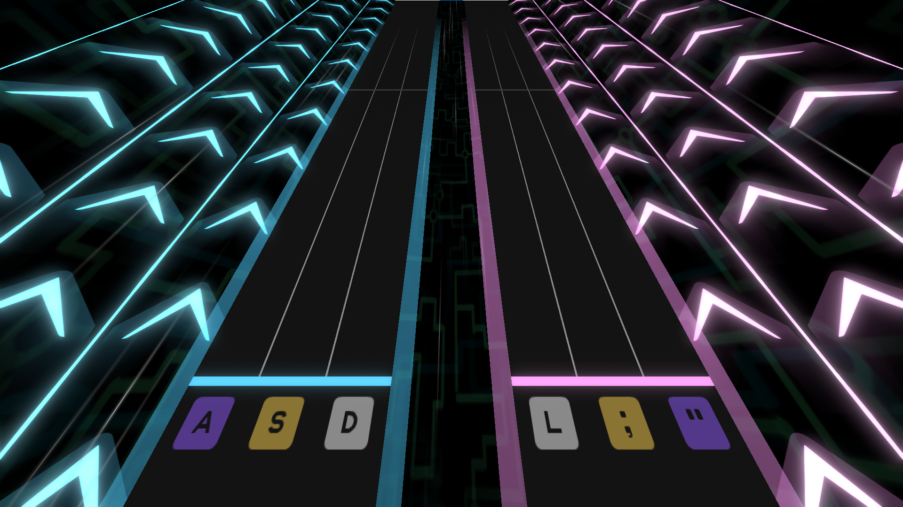

	```lua
	-- Default position of the camera. No mods necessary
	```
	</TabItem>
	<TabItem label="Up">
	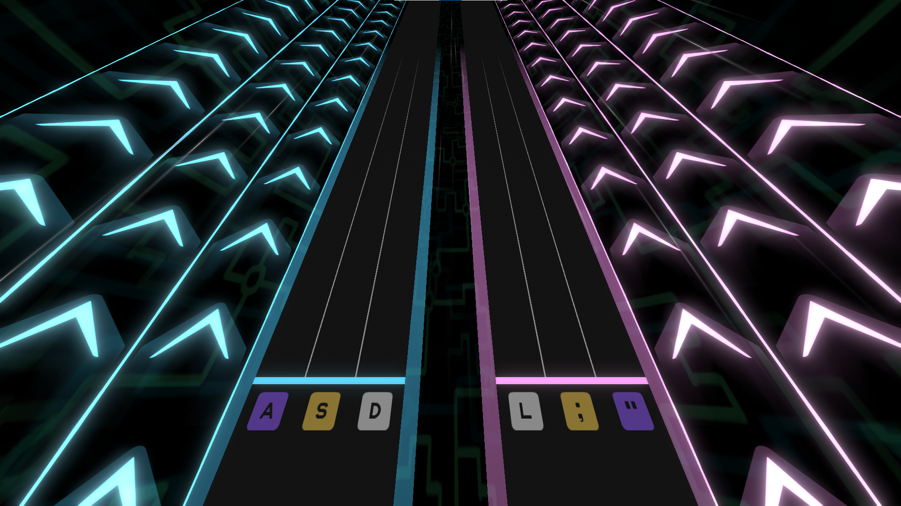

	```lua
	-- This mod brings the camera up
	xdrv.Set("camera_position_y",1,"beat",0)
	```
	</TabItem>
	<TabItem label="Down">
	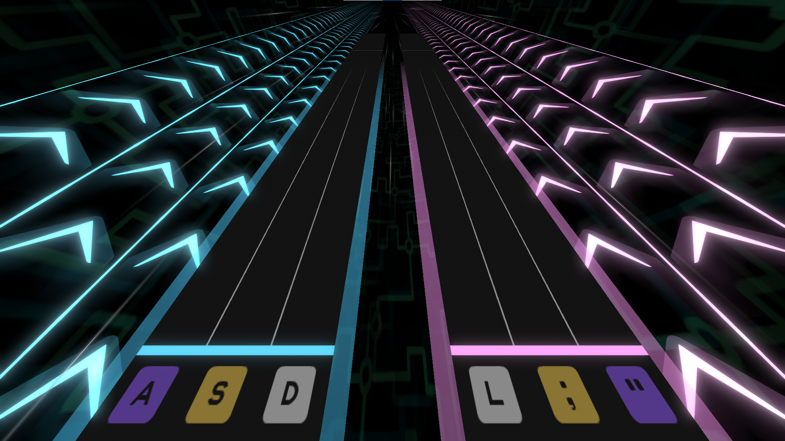

	```lua
	-- This mod brings the camera down, angling it slightly
	xdrv.Set("camera_position_y",-0.2,"beat",0)
	xdrv.Set("camera_position_z",-0.2,"beat",0)
	xdrv.Set("camera_rotation_x",-8,"beat",0)
	```
	</TabItem>
	<TabItem label="Left">
	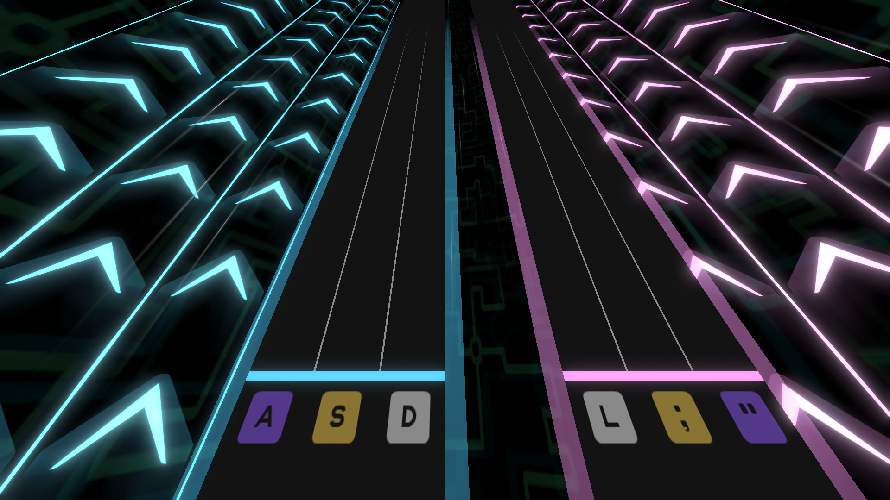

	```lua
	-- This mod brings the camera left
	xdrv.Set("camera_position_x",-0.75,"beat",0)
	```
	</TabItem>
	<TabItem label="Right">
	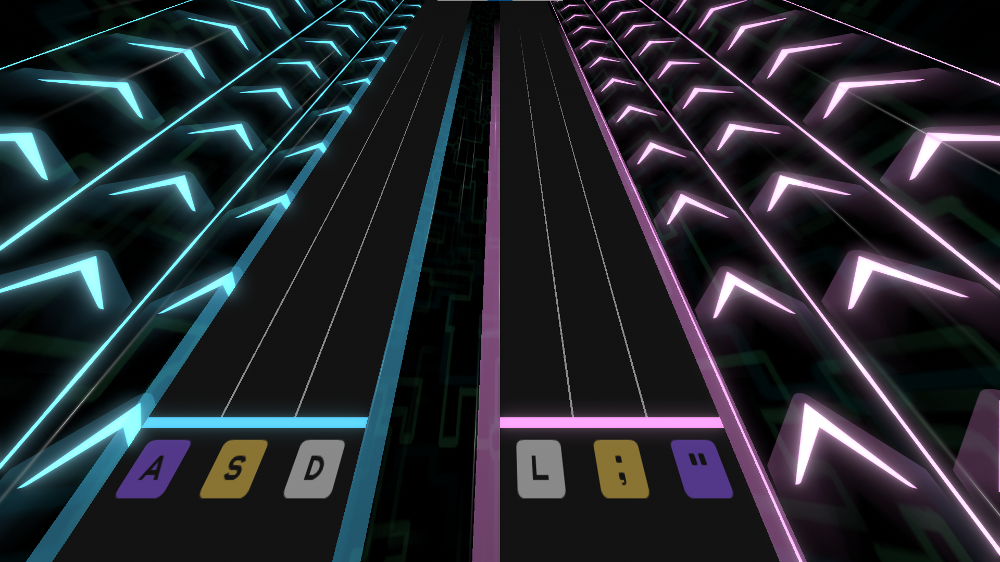

	```lua
	-- This mod brings the camera right
	xdrv.Set("camera_position_x",0.75,"beat",0)
	```
	</TabItem>
</Tabs>

---

When lowering the camera, to enhance readability and reduce claustrophobia, you may want to offset the camera by a small negative x rotation and negative z position. This brings the camera back and points the camera up slightly, making more of the track visible.

Camera motion can also be good for per-beat effects. Consider popping the camera's y position up or swaying the camera's z rotation to each side. Due to the angle making notes harder to read, you may want to lower [the note speed](#speed-changes) as well.

<Aside type="caution" title="Drift Interference">

Bear in mind that drifting also affects the z rotation of the camera. If you use `camera_rotation_z` in a section with drifts, you should ensure that the rotation mod is distinct enough as to not obscure the visual feedback caused by drifting.

</Aside>

### Track Movement & Rotation <Badge variant="note" text="Common"/>

Track movement and rotation are other common mods that charters use. Track movement is great for emphasizing percussion or other noteworthy sounds in the music. Consequently, track mods are often timed to match the gears in the chart.

Most track position mods affect the x axis, holding the track in position until returning it to rest some number of beats later. Y position can be moved similarly, but proper space between the track and the camera should be given to avoid claustrophobia. Z position can be moved as well, producing unique visual affects depending on the motion.

Here are some examples of track position along the x axis in XDRV:

<Tabs>
	<TabItem label="Default">
	

	```lua
	-- Default position of the tracks. No mods necessary
	```
	</TabItem>
	<TabItem label="Further Apart">
	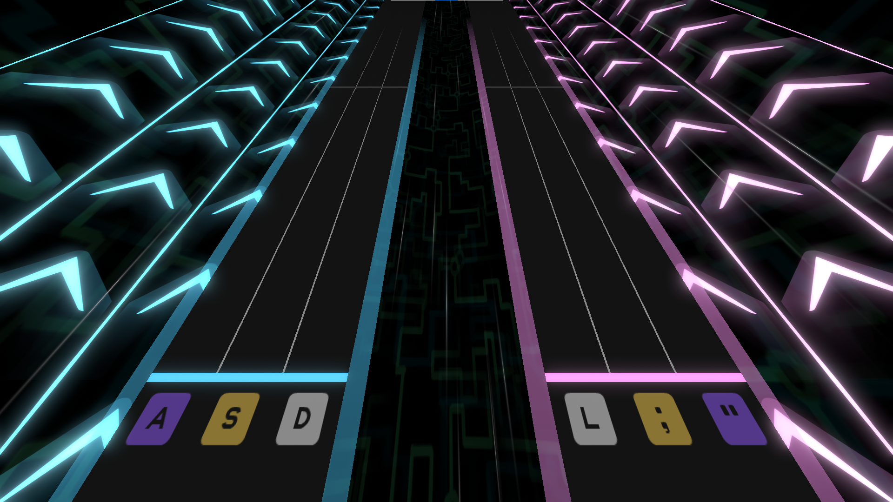

	```lua
	-- This mod brings the tracks further apart
	xdrv.Set("trackleft_move_x",-0.5,"beat",0)
	xdrv.Set("trackright_move_x",0.5,"beat",0)
	```
	</TabItem>
	<TabItem label="Together">
	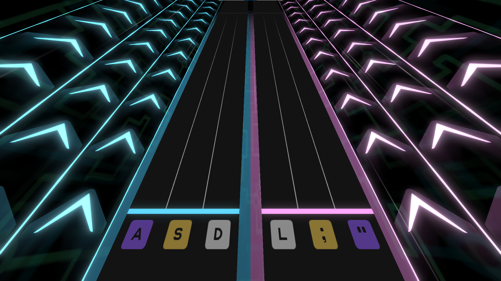

	```lua
	-- This mod brings the tracks together, making them touch
	xdrv.Set("trackleft_move_x",0.5,"beat",0)
	xdrv.Set("trackright_move_x",-0.5,"beat",0)
	```
	</TabItem>
</Tabs>

---

<Aside type="caution" title="Split Vision">
	When moving tracks away from each other, make sure that the tracks aren't too far apart. The further the tracks are from each other, the more reliant players must be on their peripheral vision, which can be annoying.
</Aside>

While tracks can be rotated on all three axis can be rotated on, charters largely only rotate tracks on the z axis, as the other two axes rotate oddly. With that said, Z rotations can be really fun, adding a lot of dimension to track motion. Barrel rolls are a favorite of charters and players alike.

### Speed Changes <Badge variant="note" text="Common"/>

Note speed changes are a common and familiar mod for XDRV charters to use. Speed change mods typically manifest in two forms: slowdowns, where an entire section of patterns will move at a lower scroll speed, or squashes and stretches, where the note speed is briefly increased or decreased before being returned to the original value. Slowdowns are great for reflecting intensity, offering an additional reading challenge to charters. Squash and stretch effects, on the other hand, are great for emphasizing impactful sounds or percussion in the song.

<YouTube id="FEGUzK2lQuw"/>

There's a lot more that can be done with speed changes, however; consider flickering between two speeds, or making notes have divergent scrolls.

<Aside type="tip" title="#SCROLL vs speed">

Speed can actually be manipulated through more than just the `speed` field; `#SCROLL` is a timing segment that can be used to create in-place speed changes. Unlike `speed`, `#SCROLL` is great for creating temporary stops or sudden bursts forward.

```
--
// Create pause
#SCROLL=0
010-010|00|0
// Speed up to keep space between beats legible
#SCROLL=2
000-000|00|0
--
// Set speed back to normal
#SCROLL=1
010-010|00|0
--
```

</Aside>

### Note Movement & Scaling <Badge variant="tip" text="Uncommon"/>

Note movement and scaling is used far less commonly than the previous mods above, but they have their own textural qualities. Note movement and scaling are great for per-beat mods, and they can also be very useful for representing foley or special sound design.

While these mods can be nice, excessive movement or scaling can jumble patterns up, making them harder to read and hit correctly.

### Field of View <Badge variant="tip" text="Uncommon"/>

Field of view is a camera mod with a lot of potential for charters. If you're familiar with perspective cameras, field of view adjusts how wide the angle of vision is from the camera. Raising the value makes the angle wider, while lowering the angle makes the angle smaller.

<div style="width:40%">
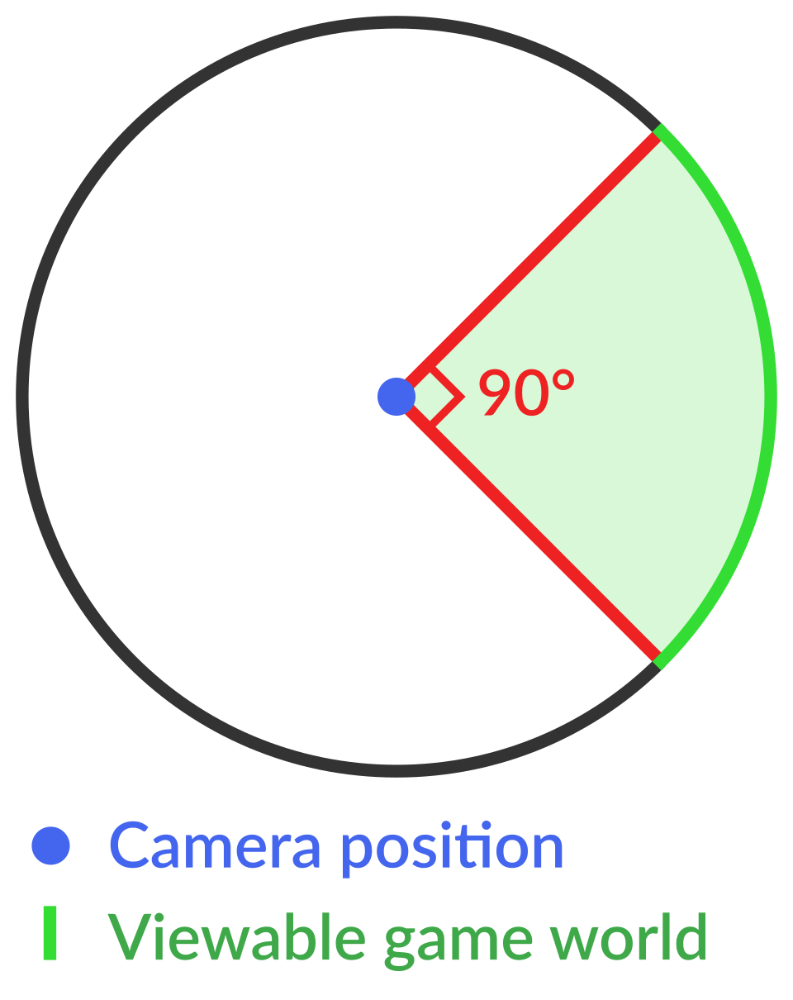
</div>

Adjusting of view can be really useful for emphasizing the speed of a section or building up to an impactful moment, but field of view can also feel awkward very quickly. Small changes to the FOV can go a long way.

<Tabs>
	<TabItem label="Default">
	

	```lua
	-- Default FOV. No mods necessary
	```
	</TabItem>
	<TabItem label="Higher FOV">
	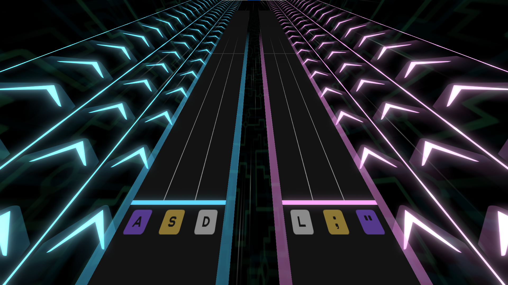

	```lua
	-- This mod increases the camera's field of view
	xdrv.Set("camera_fov",110,"beat",0)
	```
	</TabItem>
	<TabItem label="Even Higher FOV">
	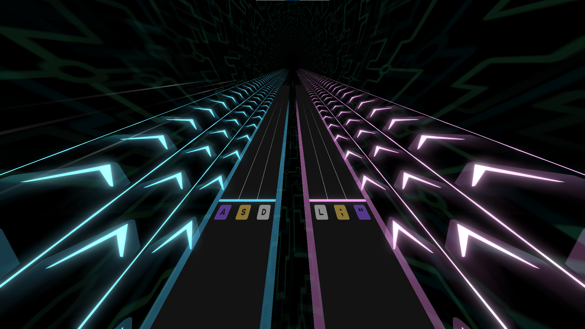

	```lua
	-- This mod increases the camera's field of view a bit too much
	xdrv.Set("camera_fov",140,"beat",0)
	```
	</TabItem>
</Tabs>

---

### Track Color & Opacity <Badge variant="tip" text="Uncommon"/>

Track color and opacity changes are only used in a few XDRV charts, but they are used to great effect. By changing path alpha, charters can make the tracks themselves pulse or cycle colors, creating a unique visual effect for key parts of the chart. 

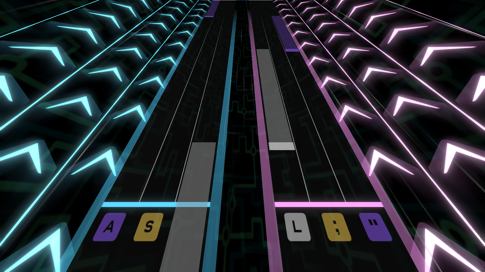

<Aside type="tip" title="Getting Player Colors">

Many charts will have the track pulse the player's gear colors, which looks nice with backgrounds that use gear colors as well. To get the player's gear colors, you must fetch the RGB components using functions:

```lua
-- Get the left and right gear colors
local leftGearColor = xdrv.GetPlayerNoteColor(6)
local rightGearColor = xdrv.GetPlayerNoteColor(7)

-- Mute color r,g,b components
leftGearColor[1] = leftGearColor[1] / 5
leftGearColor[2] = leftGearColor[2] / 5
leftGearColor[3] = leftGearColor[3] / 5

-- Repeat for right gear color...
```

</Aside>

Alternatively, by decreasing the alpha of the track, the player is able to see the ground below, making the scene feel larger and more atmospheric. Track opacity mods in particular synergize particularly well with note opacity and bloom, enhancing atmosphere further.

## Evolving Visual Conventions

A lot of the differentiation between common, uncommon, and rare mods is based in what base-game XDRV charts currently use. These visual conventions are likely to evolve over time, especially as charters try out new visual effects. Feel free to be inventive and establish visual conventions of your own!

### Other Modcharting Aesthetics

If you are coming from a different rhythm game with its own modfile aesthetics (i.e. NotITG), you may want to incorporate some of the visual style you already know into your XDRV chart's mods. Although the end result will diverge a bit from base-game XDRV mods, making your mods resemble another game's is valid.

---

At this point, you should now have a basic understanding of making visually appealing mods. While this article goes over the most common approaches and mod uses for XDRV, as with a large portion of the XDRV chart design process, the best way to improve and understand modding is to experiment and practice! 

At this point, there's not much else I could teach you about the charting process that you couldn't figure out yourself. I hope you're able to create charts for XDRV that speak to both you and the people that enjoy them.

Before you go, if you'd like to see some examples of mod functions made EX-XDRiVER, check out the next article. Otherwise, thanks for reading, and best of luck!