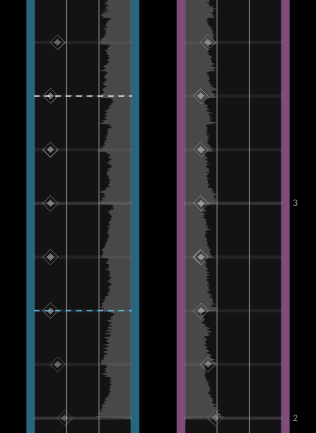
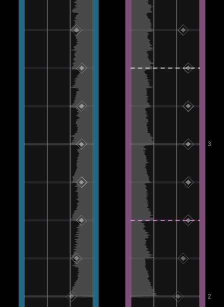
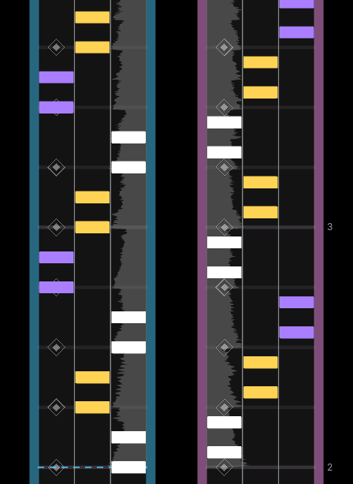
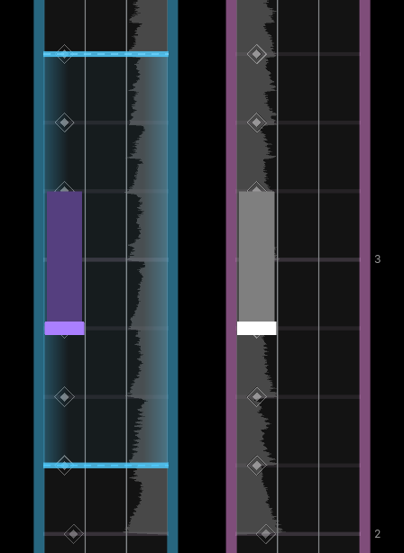
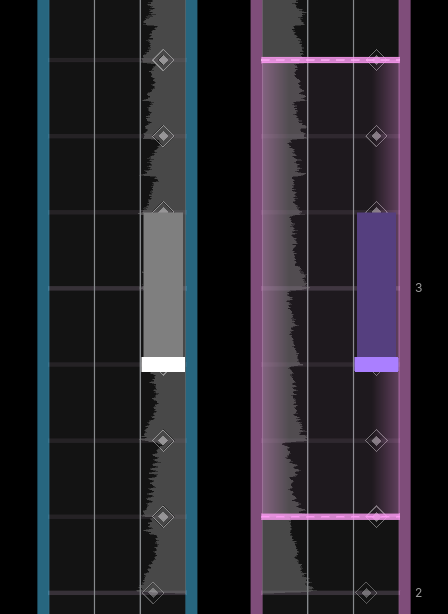
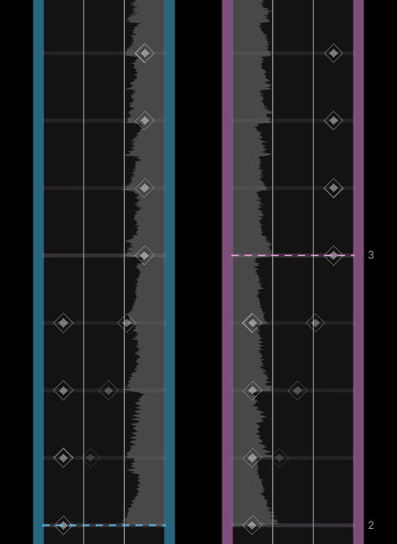

import { Aside } from '@astrojs/starlight/components';

<Aside type="note" title="Recommended Precursors">

- Finished set up for a .xdrv chart (file organization, metadata, and timing)
- Started patterning for a .xdrv chart
- Informed of general charting principles and common patterns with and without gears

</Aside>

---
 
Drifts are another note type that charters can use, and of all note types in EX-XDRiVER, drifts are unquestionably the most unique. Drifts are functionally untimed, as they do not require you to start an input on a certain beat. Rather, they require you to perform the drift, via gyroscope or manual input, for the full duration of the note. The act of drifting takes some time / motion to reach an activated state, so players have to drift before the note itself appears.

Drifts do not contribute their own combo. Rather, drifts increase the amount of score and EX given by notes within its duration. Notes on the start beat of the drift are included, while notes on the end beat of the drift are **not** included. Technically, players can release a drift early or start a drift late if there are no notes at the start / end of the drift. Players can also momentarily stop drifting in the middle of a drift if some gap in notes is present. Drifts in sections with no notes will contribute zero score or EX and can be ignored by the player.

Many new charters, including those with experience charting for other games, have a hard time incorporating drifts into their charts. Drifts can be simplified into several basic use cases and rules. Charters who adhere to these rules can incorporate drifts in a way that is fun, functional, and representative of the music.

| 
  
 | 
  
 |
| :---: | :---: |
| Left Drift | Right Drift |

 
## When To Use Drifts

One of the best qualities of drifts is that their indication (a series of small diamonds on 4th subdivisions) is equally good at representing long, sustained sounds and repetitive, sequential sounds. Here are just a few common use cases for drifts:

- There is an effect in the song that is changing over a long period of time (e.g. highpass / lowpass filter, bitcrush, reverb, etc)
- There is a riser playing for a good amount of beats
- There is a sustained background instrument that is playing one note or a series of related notes
- There is a background instrument playing a series of short, sequential notes
- There is a breakbeat, hat loop, or other percussion loop in the song
- There is a section of the song with unique / powerful atmosphere
- There is a sustained synth that is being charted in the main melody that could be emphasized further

<Aside type="tip" title="Choice Overload">
This may seem like an overwhelming amount of use cases, but like all other factors of charting, you shouldn't worry about every use case all of the time. At the end of the day, **drifts are best used when they  add something meaningful to the base patterning.**
</Aside>

## Drift Properties

Due to several traits, drifts must be implemented carefully in order for them to work properly and feel good to play.

### Drifts and Crowdedness

Drifts can add a lot of crowdedness to a section. If you already have a lot of notes in a section, a drift might be too much for the player to read, *especially* at lower difficulties. If you want to emphasize a unique-sounding part of a song, but don’t want to use a drift, you can alternatively use a simple mod, such as an upwards camera movement with a long duration.

  
 

<Aside type="caution" title="Covering Indication">
Notice what lines the indication for drifts occupy. At the start and end of a left drift, dotted lines cover the width of the left track. The diamonds between the two lines occupy lanes 1 and 4. Conversely, at the start and end of a right drift, dotted lines cover the width of the right track, while diamonds occupy lanes 3 and 6. You might want to avoid obscuring these indicators with gears, hold notes, or chords for the sake of readability. 

| 
  
 | 
  
 |
| :---: | :---: |
| Left Obscured | Right Obscured |

With that said, drifts with these indicators covered will still have some indication (the drift signals and potentially some diamonds).
</Aside>

### Drift Tails

In XDRV, all drifts need to have a tail. Not using a drift tail will result in issues when the chart is run in-game.

*These drifts are malformed!*

  
 

### Positive and Negative Drift Space

Consider the duration that drifts occupy as **positive drift space** and the duration that drifts do not occupy as **negative drift space**. For the majority of charts, the total negative drift space should be greater than the total positive drift space. In other words, the chart should have more beats of non-drifting than beats of drifting. Too much positive drift space in a non-drift-oriented chart may indicate that drifts are used too much (potentially poorly).

Additionally, the duration of positive and negative drift space is important. Typically, positive drift space should last 4 beats or longer, as short drifts feel and look strange. Between drifts of alternating directions, you should leave a minimum of 2 beats of space, though more is typically better. Between drifts of the same direction, much more space should be given (upwards of 8-16 beats) to mitigate awkwardness. If you find yourself in a situation where you need to give the player less beats of space, you may need to rework how drifts are used in your chart.

### Drifts in Lower Difficulties

In lower difficulties (BG and NM), whenever a drift is used, the density of notes and gears should be decreased considerably. This is because in lower difficulty charts, drifts are emphasized by the chart when they appear. Of course, some notes are still needed in order to make the drift contribute score and EX.

---

Ultimately, drifts are a very versatile note type, allowing you to represent background sounds that are more subtle. Still, charters should ensure that they adhere to rules that make drifts meaningful, enjoyable, and appropriate.
