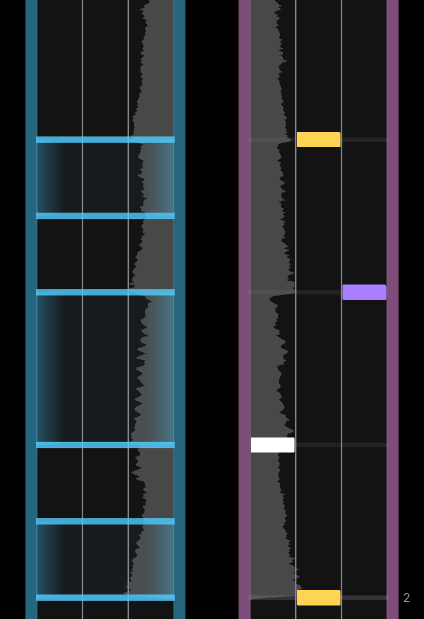
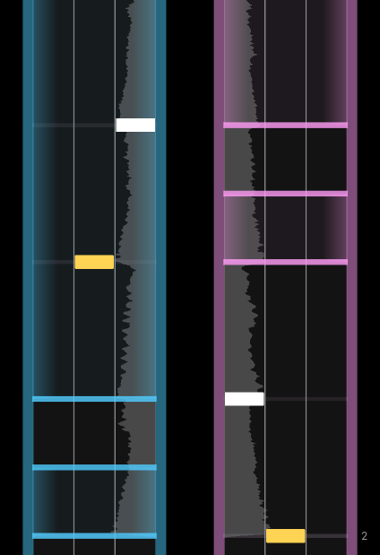
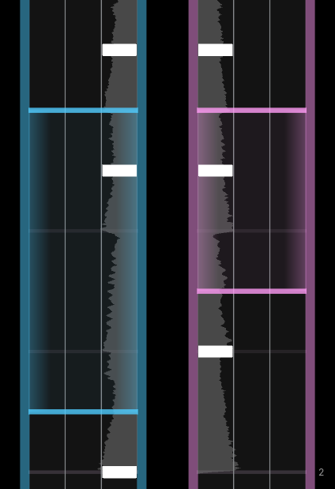
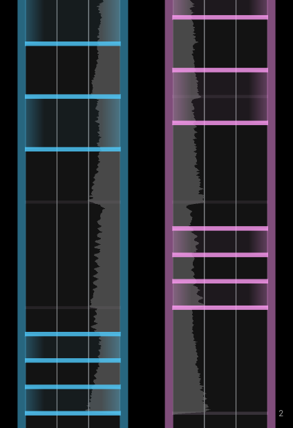

import { Aside } from '@astrojs/starlight/components';

import gearstreams from '../../../assets/patterns/gearstreams.png';
import geartrills from '../../../assets/patterns/geartrills.png';
import gearjacks from '../../../assets/patterns/gearjacks.png';
import gearchords from '../../../assets/patterns/gearchords.png';
import geargallops from '../../../assets/patterns/geargallops.png';
import lnGearCharting from '../../../assets/patterns/ln_gear_charting.png';

<Aside type="note" title="Recommended Precursors">

- Finished set up for a .xdrv chart (file organization, metadata, and timing)
- Started patterning for a .xdrv chart
- Informed of general charting principles, including essential charting
- Informed of common tap & hold note patterns

*This article talks about many base game charts in XDRV, including some that need to be unlocked or are hidden. Spoilers ahead!*

</Aside>

---
 
One of the most distinguishing features of XDRV’s gameplay is its gear notes. Although their input and timing is similar to that of tap notes, they have two key differences. First of all, the default control scheme for controllers requires that players flick their left or right joystick to hit a left or right gear respectively. Secondly, all gears are composed of head and tail inputs. The player must perform one input at the head and one input at the tail. Therefore, all gears must be placed in pairs on each side. All these quirks must be considered by charters.

Although gears can be treated as a singular note, charters often use them in a way that suggests they have twice the amount of emphasis as one tap note. This makes sense when considering that gears cover 3 lanes, despite only requiring 1 input to hit. When using gears, the charter should consider their emphasis as greater than a tap note.

## Use Cases for Gears

Gears can be used to accomplish various tasks in charts. While there are some generic patterns that can incorporate gears, gears create some special motions that clever charters can capitalize on. One of the main factors of consideration for gear usage is that they increase keyboard and controller difficulty to a different degree.

### Gears in Sample Charting

As with tap and hold notes, left and right gears can be used to represent a specific sound. In many charts, for example, gears are used for kicks, snares, or crashes. The head and the tail of a singular gear can even be used to represent different percussion without requiring different inputs. For instance, in songs that have kick-snare patterns, some charts have the heads of gears represent kicks and the tails of a gears represent snares (or vice versa). Gears can also be used to represent a unique synth, bass, or sample. This separation of inputs feels dynamic and is readily perceived, making for fun and dynamic charting when used.

While gears can be great for representing specific sounds, they can also be combined with taps and holds to represent a main melody. Many charts use the duration of a gear to represent a long synth sound, rather than having a hold note be there. This implies sustain without requiring an input be held down, opening the door to secondary patterns.

### Left-Right Gear Balance

Gears contribute a lot to the feeling of balance of a chart. While using only left or right gears for a section can make for an interesting or meaningful gimmick, using left or right gears to an excess can quickly make the chart feel skewed to one hand. Often, the easiest way to resolve this issue is to mirror sections where a lot of gears are on one side.

| 
  
 | 
  
 |
| :---: | :---: |
| Unbalanced | Balanced |

### Controller Alternating

Alternating is the process by which controller players move their thumb from a face input (tap/hold notes 3/4) to one of the joysticks to hit an upcoming gear. As this movement has some travel time, patterns where an inner lane note is placed close to a gear (both before and after) are more demanding for controller players than keyboard players.

With that said, there is nothing wrong with requiring the player to alternate between gear and inner lane inputs quickly. In fact, many base-game charts do this. What matters is that this difficulty is purposeful and reasonable within the chart.

  
 

<Aside type="tip" title="Inner Lanes and Gears">
You may wonder if it is possible for a controller player to hit an inner lane note and a gear on the same side simultaneously without cheesing the pattern. The answer is that, in some cases, is yes! This note combination called a crossgear and is discussed further in [Charting Crossgears](/xdrv-charting-guide/patterns/gears).
</Aside>

### Gearjacks and Geartrills

Gearjacks and geartrills are gear-specific patterns that some charts use. Keyboard gearjacks and geartrills are functionally adjacent to other jacks and trills, just on the pinkie finger. On controller, however, players must wait for the joystick to return to the deadzone before performing the next input. While some players can flick back and forth to pass through the deadzone, this behavior is inconsistent without precise configuration. As a result, gearjacks and geartrills (gearjacks especially) at high BPMs are harder for controller players than keyboard players.

  
 

<Aside type ="caution" title="Wait, nuance!">
Although geartrills and gearjacks require additional consideration, they can do quite a lot for a chart’s expressiveness. If you are mindful of the difficulty disparity, these patterns can be included without issue.
</Aside>

## Common Gear Patterns

Gears can be incorporated into a variety of classic tap and hold note patterns to create patterns that feel more unique to XDRV. Here are a few of these patterns and their appearances in base-game charts:

| Name & Image | Description |
| :--- | :--- |
| **Gearstreams** | Streams with gears placed at certain intervals. The chords are typically placed to the rhythm of percussion, distinct synths, or some other sounds of emphasis. Also does not take any specific shape. Considerably harder than normal streams for controller players, but only a bit harder for keyboard players. *Use Examples: CANDYLAND EX, FRONTLINERS EX* |
| **Geartrills** | Trills which alternate between gears and notes or gears of opposite sides. Typically, for geartrills alternating between gears and notes, the gears and notes are on opposite tracks. *Use Examples: valor/starcross EX, UTF-8000000000 HY* |
| **Gearjacks** | Jacks the notes are two gears, requiring repeated and swift input of the gear’s key / joystick. Almost exclusively reserved to two gears on the same side. *Use Examples: City in the Clouds EX, Wonderblossom HY* |
| **Gearchords** | Chords where at least one of the notes on the line are gears. Can consist of two gears on both sides with or without additional notes, or one gear with at least one additional note. Can use hold notes instead of tap notes, which can be more readable than tap notes when overlapping gears. *Use Examples: Wonderblossom HY, Fly Wit Me EX, IGNITED EX* |
| **Geargallops** | Gallops where one of the two notes (or potentially both notes) are gears. Can be on the same track side or on opposite track sides. *Use Examples: valor/starcross EX* |
| **LN Charting + Gears** | Patterns that utilize hold notes and gears simultaneously. Sometimes, a gear is placed at the end of a hold note. Other times, gears must be hit in the middle of a hold note. Often used to create crossgears with better indication (see [Charting Crossgears](/xdrv-charting-guide/patterns/gears). *Use Examples: Luminous Race HY, Cosmogyral HY, FREAK*TEK EX* |

---

All and all, gears are one of the most unique elements of XDRV patterning and should be utilized by charters. Charters using gears should consider the ways that keyboard and controller players experience patterns differently, paying specific attention to difficulty disparities. While all charts using XDRV’s mechanics will have some difference in difficulty between playstyles, charters can ensure that this difference is within reason.