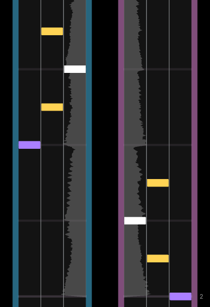
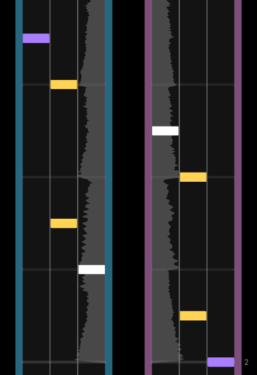
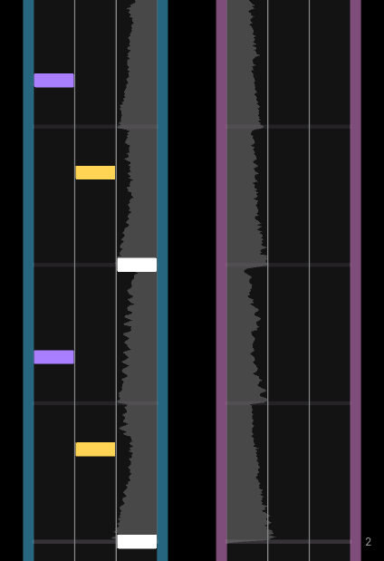
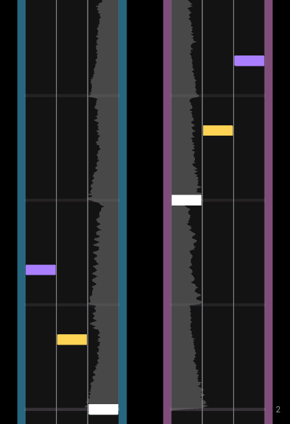
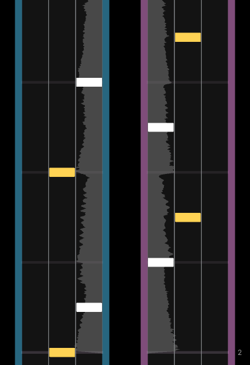

import { Aside } from '@astrojs/starlight/components';
import { CardGrid } from '@astrojs/starlight/components';
import { Card } from '@astrojs/starlight/components';

<Aside type="note" title="Recommended Precursors">

- Finished set up for a .xdrv chart (file organization, metadata, and timing)
- Started patterning for a .xdrv chart

*For every rule that you can follow when charting, there is an equally good reason to break it. Use the patterning information as guidance, not gospel.*

</Aside>

---

Pattern creation is fundamental to the gameplay of XDRV charts. Obviously, without any notes, gears, or drifts to hit, there is nothing for the player to do for the song’s duration, so the chart lacks any form of gameplay. Less obvious is that a chart's quality is grounded in the theory behind its patterns. Experienced XDRV charters use knowledge of the game’s mechanics, common patterns, and per-chart goals when patterning to a certain song.

In next to all rhythm games, the fundamentals of a “good” chart can be broken down into **3** maxims:

<CardGrid>
	<Card title="Music Sync" icon="seti:audio">
	How a chart's patterns fit a song’s rhythms and intensity.
	</Card>
	<Card title="Visual Appeal" icon="seti:image">
	How a chart's patterns look, including clarity and balance.
	</Card>
	<Card title="Fun" icon="star">
	How a chart plays on all intended playstyles.
	</Card>
</CardGrid>

For most cases of charting, all three of these factors contribute to the player's experience with a chart and a chart's perceived quality. Music sync, visual appeal, and fun can all be achieved through various means. When patterning, music sync is often the easiest to fulfill. If you listen to a song closely, it is easy to make a chart that syncs exactly to a song for the entire duration. However, caring too much about music sync can quickly come at the expense of visual appeal and fun.

## Styles of Charting

When charting, there are many basic ways that patterns can be done. These way can be grouped into different styles of charting. Effective charters can use a combination of these styles to get the best results.

### Pitch Charting

Pitch charting is a style of charting in which notes are placed relative to each other in terms of their pitch. If a proceeding note has a higher pitch, it may be placed in a lane to the right. If a proceeding note has a lower pitch, it may be placed in a lane to the left. If a proceeding note has the same pitch, it may be kept in the same lane. This relationship can be reversed so that higher pitches are to the left and lower pitches are to the right.

Pitch charting not only follows music sync, but is also one of the most music-accurate ways of charting. As it replicates movement across an instrument, it is often naturally fun to play. Some melodies may chart to patterns that are unreasonably difficult or static, however, resulting in less fun patterns. Visual appeal is also a challenge, as some melodies may miss certain notes, and therefore certain lanes. The best way to tackle this issue is to avoid rigidity. Different relationships can be used for similar changes in pitch, and the relationship of lane to pitch can be reversed whenever the charter sees fit. 

<Aside type="tip" title="Pitch as Motion">

Pitch charting is more so about capturing the **motion** of sounds and their pitches relative to each other, rather than the note's exact pitches. If a song section can be represented with left-to-right movement, it can likely be represented as right-to-left as well.

</Aside>

### Sample Charting

Sample charting is very similar to pitch charting except that different note types or lanes correspond to specific sounds. If you have a bass-kick pattern, for instance, tap notes may be charted to the kicks and hold notes may be charted to the bass. You may also give these note types specific lanes or even entire tracks. Kicks may stay to lanes 1-3, while bass stays to lanes 4-6. Sample charting can also use different quantities of notes to emphasize different sounds as well. For instance, if a kick-snare pattern is present, for instance, many charters will make the kicks single notes and the snares double notes (also called a chord).

Sample charting is, again, great for music sync, as these separations, when done well, are easily absorbed by players. Sample charting can introduce issues with visual appeal and fun, resulting in imbalanced lane choices and boring rhythms. Again, redefining the organization of notes when necessary can mitigate these issues entirely. At the same time, purposefully keeping note placement stationary for multiple beats can be impactful and memorable to players. It is best to decide whether or not to make a sample-charted pattern more dynamic or stationary on a case-by-case basis.

### Essential Charting

Essential charting is the method of reducing complicated rhythms to simple, essential patterns. This typically does not mean simplifying the rhythms used; rather, placement of notes are simplified to patterns that are common across many other vertical-scrolling rhythm games. Essential charting is a useful tool for converting unwieldly or busy sections a song to enjoyable, yet representative patterns.

<Aside type="caution" title="Essential = Generic?">

When used well, essential charting is great at fulfilling music sync, visual appeal, and fun, as the patterns used in essential charting are tried and true. With that said, the drawback of essential charting is that overuse of essential patterns can make a chart feel generic. It’s good to include classic patterns in your chart, but they should not dominate your entire chart.

</Aside>

## Considerations of Charting

These three styles, in isolation, can get you a good bit of the way in terms of charting for XDRV. With that said, they can also mislead you into thinking charting is more of a mathematical process than it really is. In reality, charting is as much a mechanical process as it is artistic. Throughout your creation of patterns, you can make decisions that deviate from the above methods yet improve your chart overall.

### Continuous Treatment of Track

For any new charters who see that the lanes are divided into two tracks (three lanes for the left hand, and three lanes for the right hand), it is intuitive to have long stretches of patterning be on one track. Unfortunately, doing this can result in excessive density on one hand, making for patterns that require more dexterity than reasonable to expect. It can also make sections of a chart look empty or unbalanced. When charting, players should primarily consider the 6 tracks as a continuous space rather than two separate spaces. This means that a single instrument could be charted in all 6 lanes (potentially 8 lanes if gears want to be used as well). With that said, limiting a section to one track can be fun and purposeful, especially for more technical charts.

| 
  
 | 
  
 |
| :---: | :---: |
| Separate | Continuous |

### Mirroring & Hand Balance

In many songs, a specific melody or rhythm, best represented by a pattern of your choice, may repeat a few times. To avoid this pattern becoming repetitive, it can be mirrored where it recurs. This makes the pattern feel fresh while maintaining the relationships between notes, much like flipping the note-pitch relationships of pitch charting. 

| 
  
 | 
  
 |
| :---: | :---: |
| Unbalanced | Balanced |

<Aside type="caution" title="Excess Mirroring">

If a pattern is mirrored more than 3 times, the pattern may still become repetitive for players (since you are repeating the pattern at least once). If this happens, a new, potentially less representative pattern may need to be created.

</Aside>

Mirroring can also help considerably with hand balance. When charting, it is a good idea to make sure that note placements are not too concentrated on one hand. Mirroring sections can make a chart more fair for players of different hand dominances (whether they be left-handed, right-handed, or ambidextrous). With that said is fine if portions of your chart are kept to one hand; in fact, you can create very interesting patterns by restricting lane usage to one hand for some amount of time.

### Limiting Lanes

In many base game charts, charters exclude certain lanes when patterning specific sections. Limiting lanes can be good for controlling difficulty on dense sections, making the player responsible for less distinct inputs. The strategy can also be useful for creating unique patterns that better represent the sound of a section. When omitting lanes, charters will typically omit lanes symmetrically; either the two outer lanes, two inner lanes, or two middle lanes. Occasionally, especially in easier difficulties where a drift is used, the lane furthest from the drift direction is omitted. (Left drift omits lane 6, right drift omits lane one.) Charters can get very creative, though too much creativity can result in odd-looking or imbalanced sections.

  
 

### Progression & Pacing

When charting, charters should consider how the difficulty of the chart changes with the song. Typically, more intense parts of songs such as drops, build-ups, and speed-ups deserve more difficult or more technical patterns. Conversely, calm parts of a song should receive easier, less busy patterns.

### Syncopation & Omission

Common practice in many .xdrv charts is to simplify complicated or dense rhythms to simple patterns, where sounds of less emphasis are purposefully not recognized with a note. This process is known as syncopating. Syncopating is great for limiting difficulty in easier charts, but it is also great for maintaining proper difficulty progression in harder charts, especially in slower sections.

Although it may be tempting to represent multiple elements of a complex composition with different notes and patterns for each element, it can be easy to overdo. If players are unable to decipher what patterns go to what instrument in your chart, they may feel that your chart is overcharted (where the song is overrepresented / too difficult). 

<Aside type="tip" title="Simultaneous Representation">

Typically, you should represent no more than **two** parts of a composition at once with notes. The most frequent combo to represent simultaneously is melody and percussion.

</Aside>

### Charting to Difficulty

Charting to difficulty is the process in which a charter creates patterns with a specific difficulty rating in mind. Charting to difficulty can be good in stabilizing the difficulty progression of a chart (as it prevents any one section from being charted too difficult), but striving for the wrong difficulty can result in undercharting (where the song is underrepresented by the chart) or an overcharting. Newer charters should not chart to difficulty too strongly until they have a good understanding of EX-XDRiVER’s difficulty scale, which can only come with time or purposeful observation.

### Stamina vs Tech Charting

If you are familiar with the step-based rhythm game scene, then you are probably *also* familiar with stamina and tech charts. Stamina charts are charts where lengthy streams of notes are used, which require a lot of stamina to hit completely. Tech charts, on the other hand, are charts that focus more on tricky rhythms and combinations of simultaneous notes, known as chords.

The basic concepts of “stamina” and “tech” charting can be applied to XDRV charts as well, despite the game not being step-focused. In fact, you can find many of these tendencies in base-game XDRV charts. Charts like CANDYLAND and LUMINOUS RACE are more akin to stamina charts, while charts like And So You Felt or City in the Clouds are more tech-adjacent. You don’t have to commit a chart to one of these styles for a chart, but when warranted, it can give a chart some flavor.

---

As demonstrated by this article, there is a lot of nuance as to how XDRV charts can be patterned. You shouldn’t be too worried about adhering to these principles. Rather, you should allow these principles to naturally guide you towards your decisions on charting certain sections. The next section will go over common note and hold patterns that you can use in charts.
