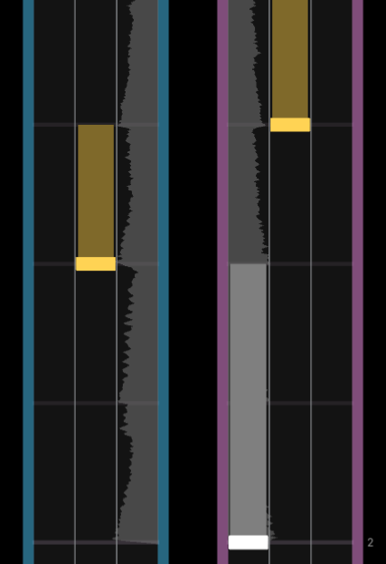
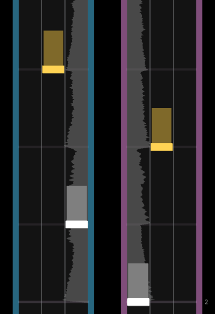
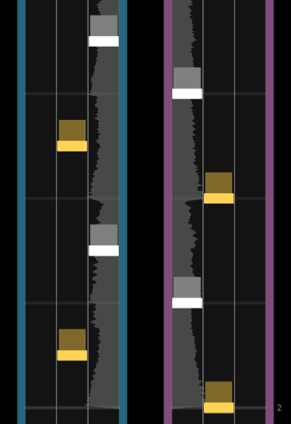
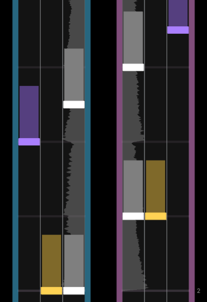

import { Aside } from '@astrojs/starlight/components';
import { Card } from '@astrojs/starlight/components';

<Aside type="note" title="Recommended Precursors">

- Finished set up for a .xdrv chart (file organization, metadata, and timing)
- Started patterning for a .xdrv chart
- Informed of general charting principles, including essential charting

*This article talks about many base game charts in XDRV, including some that need to be unlocked or are hidden. Spoilers ahead!*

</Aside>

---
 
Hold notes are a non-unique, yet useful note type that charters can incorporate into XDRV charts. Hold notes in XDRV are composed of a head and a tail which are  stored separately in `.xdrv` files but are treated as one note object in Trackmaker. While hold notes can be used in various different ways, it is important to consider the aesthetic and gameplay properties they simultaneously carry. As in most rhythm games, hold notes can be excellent at indicating that a sound is sustained for some time. In XDRV, however, hold notes can be used to indicate more than just sustain. This is because XDRV hold notes do not have release timing. The player can release a little bit before or any time after a hold note ends, and they will not be penalized with combo loss.

## Hold Note Lengths

 To help convey how different lengths of hold notes can be used, these notes can be broken down into three different types.
 
 | 
  
 | 
  
 | 
  
 |
| :---: | :---: | :---: |
| Long | Medium | Short / Pseudo |

The hold notes which are the best at representing sustained sounds, known as **long hold notes**, are hold notes that last for 1/4 subdivision or more. At typical BPMs, players will purposefully hold for the full duration of the hold notes. This makes hold notes feel very substantial in charts. Common practice for charters is to place notes around long hold notes, effectively representing two different sounds in a song at once. With that said, some combinations of long hold notes and short notes can be excessively difficult to hit, requiring a level of finger independence that players at *all* skill levels may lack.

Shorter than long hold notes, **medium hold notes** are hold notes that last for approximately 1/8th subdivision. When encountering medium hold notes, players are more likely to hold for the full duration of the note. Depending on the BPM, however, more experienced charters may release earlier, treating the holds more like taps. Medium hold notes have two very common use cases. When paired with other medium hold notes, the resulting chordholds can fit the sound of synth impacts perfectly. Alternatively, many charters pair taps with medium hold notes to represent a bass-kick pattern, which is very common in songs.

The shortest of the three categories, **short hold notes** are hold notes that last for 1/16th subdivision or less. This hold note variety can also be described as "pseudo" because, at typical BPMs, the player does not need to mindfully hold a key down to hit the whole note. While on sightread, players may hold down briefly to hit short hold notes, they may take advantage of XDRV's leniency in later runs by treating the notes as regular taps. Short hold notes are best used to separate a note from other notes without adding difficulty in the way that a chord or gear would. These notes do still add visual clutter, however, which may be too much depending on the section you are charting.

<Aside type="caution" title="Short Hold Note Overuse">

A common pitfall that some newer charters experience is that they use short hold notes that feel empty or out of place. While a short hold note might be the most representative note type for a certain sound, it may not look or play the best. If a short hold note feels unsatisfying, it can usually be made better by replacing it with a medium hold note or just regular notes.

</Aside>

### Combining Hold Note Lengths

The main reason that distinguishing hold notes based on length is important is because hold notes of different lengths can look odd or unbalanced when placed in close proximity of each other. While not hard rules, a few combinations of hold notes generally look best. In most cases, long hold notes can be combined with medium hold notes without issue, while short hold notes are best used amongst other short notes or taps.

### Offsetting Tails

In some charts, the tails of hold notes are offset backwards by 1/16th subdivision. This is commonly done in dense sections to make reading easier by decreasing simultaneous note elements on one lane. In other charts, the tails of hold notes are offset forwards by 1/16th subdivision or more. This can be used to exaggerate the overlap, low attack, or pitch bending of a synth. Depending how you do it, offsetting hold notes' tails can make for more visual clarity *or* visual intrigue.

  
 

### Simultaneous vs Staggered Releases

When multiple hold notes occur simultaneously, charters must decide whether to have hold notes end all at once or not. Simultaneous note releases have an inherent clarity, so they are always a good option. Staggered releases, on the other hand, can look strange if the distance between releases feel arbitrary. Equal spacing between releases is common for staggered notes.

## Base-Game Hold Note Usage

This is a non-comprehensive list of base-game charts that effectively use hold notes in various ways.

- No Tomorrow: HY
- Cosmogyral: HY
- Sigrún: HY
- cybercrush perplex: HY
- Rainbow Raceway: HY
- FREAK*TEK: HY
- And So You Felt: HY, EX
- Mahika: HY
- Futari no Sekai: EX

---

While trying to incorporate some of the above patterns can be a good thing, you should not try to compose your chart of only these basic patterns. You should still be willing to come up with new or modified patterns that better fit your song. Pure classic patterns are best used in moderation.
