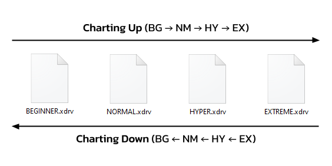

import { Aside } from '@astrojs/starlight/components';
import { Steps } from '@astrojs/starlight/components';

<Aside type="note" title="Recommended Precursors">

- Finished set up for a .xdrv chart (file organization, metadata, and timing)
- Started patterning for a .xdrv chart
- Informed of general charting principles and common patterns with and without gears

*While the content within this article is accurate, the article as a whole is in need of a revision. As a result, some formatting is missing.*

</Aside>

---

import { Card } from '@astrojs/starlight/components';

While creating higher difficulties (HY and EX) is the starting point for the majority of charters, making lower difficulties may also be of interest. It’s important to recognize that a portion of XDRV’s player base prefers to play the game’s easier difficulties (BG and NM). Therefore, if you want your charts to be accessible to more of XDRV’s playerbase, making lower difficulties for each song you chart is the best way to do it.
Of course, charting lowdiffs (shorthand for lower difficulties) takes time. Charting lowdiffs also requires a different suite of knowledge than charting highdiffs (shorthand for higher difficulties).

## Charting Up vs Charting Down

When creating a full set of difficulties (under the presumption that the charter plans to create a BG, NM, HY, and potentially an EX or OV), there are two ways that a charter can go through the charting process: charting up and charting down.

<Card title="Charting Down" icon="down-arrow">
When charting down, the charter creates the chart with the highest difficulty first. Then, the charter works downward, creating content for each lower difficulty until the entire set of charts is done. Charting down is typically a much faster process than charting up, as content made for the previous difficulty can be simplified or removed without requiring sweeping redesigns or additions. This also results in a set of charts where similar skills are challenged across each difficulty.
</Card>

<Card title="Charting Up" icon="up-arrow">
When charting up, the charter creates the chart with the lowest difficulty first and then works upward, completing the hardest chart last. Pattern choices made for a lower difficulty may not make sense in the higher one, requiring full redesigns. The result of this extra effort is that each chart in the set feels more unique from the previous.
</Card>

  
 

When creating 4 or more difficulties, some charters like to split their approach in two different directions by charting up for the highdiffs (higher difficulties HY, EX, and OV) and then down for the lowdiffs. The order by which this is done does not matter. Through this method, the resulting charts are cohesive for the lowdiffs and unique for the highdiffs. With that said, deciding to chart up or down is solely based on the personal preference of the charter.

  

While we have not discussed modding yet, now is a good time to modding can also be done upwards or downwards. Modding down allows for more code reuse and cohesiveness, while modding up encourages more unique mods for each difficulty.

## Beginner-Difficulty Charting

When making BEGINNER charts, the most important thing to consider is simplification. BEGINNER players have a hard time hitting atypical rhythms. When creating BEGINNER charts, especially at the lower difficulties, your choices of rhythms should stick to 4ths, using 8ths or offbeat 4ths with some restraint. In easier BEGINNER charts, these groups are broken up into groups of 3 or 5. This leaves gaps of empty space, which is okay. The process of not representing every sound in a rhythm is known as syncopating, and many charts of all difficulties do this.

You should also simplify what lanes you are placing your notes in to make them more readable. Notes that are placed in lanes distant from each other can be difficult for new players to read. In contrast, notes in adjacent lanes or the same lane can be easily followed by players. This is why many BEGINNER charts use a lot of stairs and jacks (albeit at low subdivisions). BEGINNER charts also use two-lane trills, mitigating the issue of readability by keeping distance consistent between notes. When gears are used for a pattern, they are either used exclusively, or they are combined with tap and hold notes with low density.

Though BEGINNER charts are mainly composed of single notes, these charts can still throw in one handed or two handed chords. However, when this is done, the chords are typically surrounded by empty space. Sometimes, the lanes that a chord uses are notated by tap or hold notes prior. Hold notes are frequently used in BEGINNER charts, though they are typically at least a beat long. Sometimes, the ends of hold notes are timed to a sound in the song, representing the song better without adding an additional input.

BEGINNER charts often incorporate hold notes into their patterns, although their usage of hold notes follows some general rules. This is because new players are more likely to input the holds unconventionally. Hold notes should have a length of a beat or longer, and in most cases, hold notes should also end on an on-beat. When hold notes are present, the density of your chart should decrease. Simultaneous holds, including chordholds, require the most scrutiny at the BG level: since new players treat holds strangely, the hold notes should end simultaneously for the best readability.

As previously stated, when drifts are used, the density of notes drops dramatically. In BEGINNER charts, drifts are the primary element of expression when they are used. Also stated in [25] Adding Drifts, you need at least one note in the section for the drift to matter.

### Normal-Difficulty Charting

While a lot of the rules of BEGINNER charting fall under the umbrella of “simplifying,” the rules of NORMAL charting are a combination of simplification and accurate representation. Lower numerical difficulties for NORMAL charts use more simplification, while higher numerical difficulty charts focus more on representation.

Instead of being limited to 4ths and sparse 8th like in BEGINNER charts, NORMAL charts can more readily and frequently incorporate 8ths. Normal charts can also begin to incorporate 16ths, although simplified lane placement and a decrease in density is required for 16th patterns to feel on-difficulty. Likewise, charters can worry less about adjacent or stationary lane usage for NORMAL difficulty charts. At this point, the player is assumed to be capable of reading most tap note patterns, although more sporadic patterns (jumping from 1/6) can feel unwelcome.

Hold notes can also be incorporated more creatively at the NM level. Hold notes in normal charts should last for at least an 8th in most cases, but otherwise, usage of hold notes is to your discretion. Chords can also be more heavily incorporated into NORMAL charts. In fact, incorporating chords to a lowdiff chart can add variety to a chart that may feel bland otherwise.

In NORMAL charts, patterns can incorporate gears in more unique ways. Density does not to be decreased as much, and gears and taps can be combined in more unique ways. Tap-gear chords, trills, and even streams (at a low enough subdivision) can fit perfectly into a NORMAL chart while also introducing more technical patterns to intermediate players.

## Experiencing the Difficulty Gradient

In XDRV, each type of difficulty corresponds to a different portion of the numerical scale. BEGINNER charts range from 1-6, NORMAL charts from 5-10, HYPER charts from 10-13, and EXTREME charts from 12-15. Charts of each numerical difficulty require a different approach to charting. The best way for charters to understand the nuances of XDRV’s difficulty gradient is to play through a selection of charts from the base game. Consider doing the following exercise:

<Steps>
1. Create a document or text file.
2. Choose a random chart of Difficulty 2, and play through it.
3. On the document / text file, take notes on stand-out decisions that the charter made for the chart. This could include where notes are placed, how note types are used, and how rhythms are used.
4. Either select a new chart of the same difficulty or a chart from one difficulty up. Then, progress forward.
5. Stop once you feel that you have seen enough charts and understand the difficulty gradient better.
</Steps>

*Here's an excerpt from a larger study I did.*

> Resurrection BG 2:
> - No smaller subdivisions than 4ths charted
> - Drifts were used sparsely
> - Lane usage is restricted to make some note usage more impactful (intro restricts to center 4 lanes)
>
> Station 3:
> - Once again, no smaller subdivisions than 4ths
> - Simultaneous inputs hardly ever happen, only once
> - Taps during a hold also occur, but are low-energy (halves)
> - No simultaneous gear-taps, gears occur in isolation

---

Though it does take considerably more effort, creating lowdiffs for your custom charts is a great way to make your charts accessible to a larger portion of XDRV’s playerbase. By applying general rules for BEGINNER charts and striking a good balance between simplicity and representation for NORMAL charts, you can create lowdiff charts that fit perfectly into the larger chart catalog and difficulty scale of XDRV.